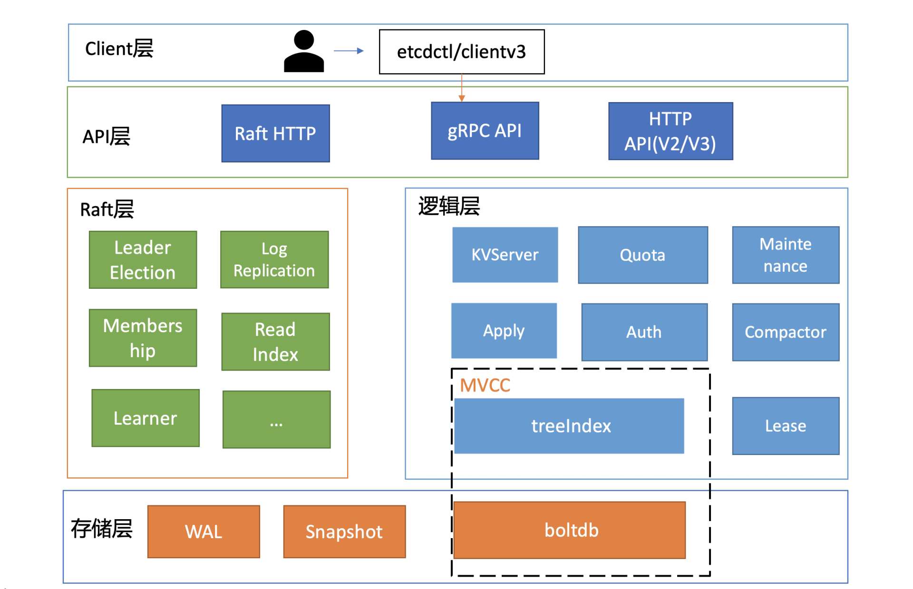
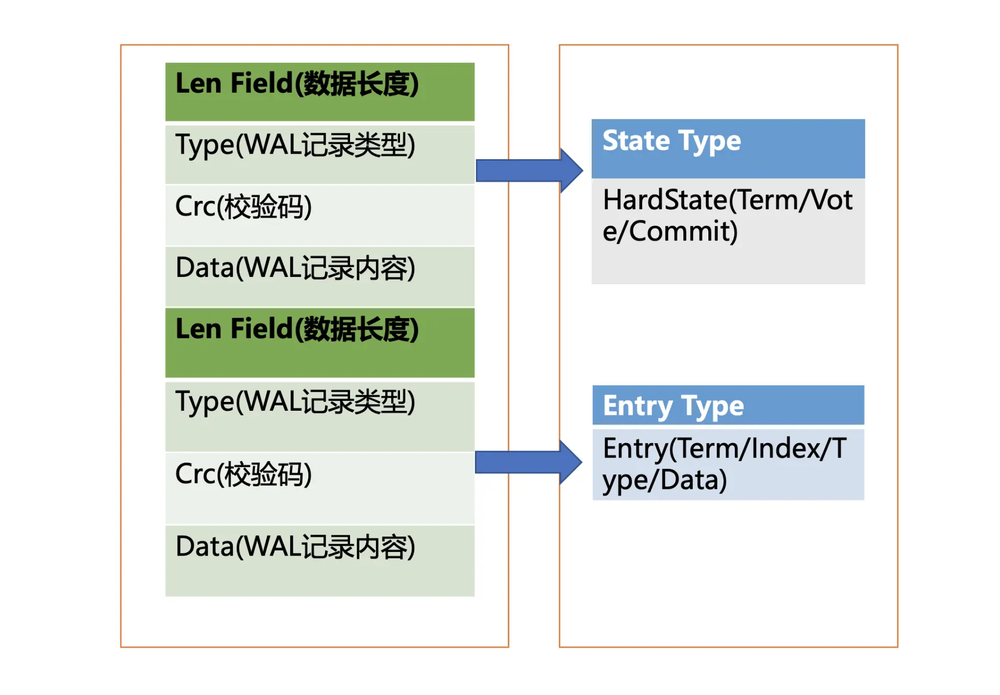
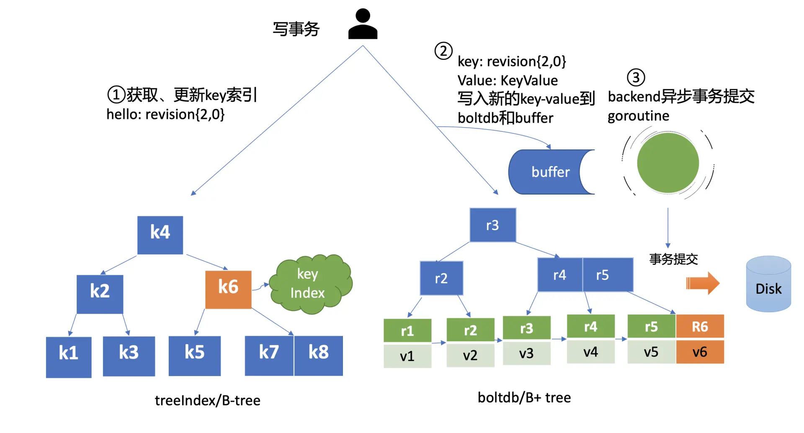

### 定义 

**etcd**是由CoreOS开发，用于可靠地存储集群的配置数据的一种持久性，轻量型的，分布式的键-值数据存储组件。etcd 基于 **Raft 协议**，通过复制日志文件的方式来保证数据的**强一致性**。

虽然 etcd 是一个强一致性的系统，但也支持从非 Leader 节点读取数据以提高性能。

**etcd 默认数据一更新就落盘持久化，数据持久化存储使用 WAL (write ahead log） ，采用预写式日志。**

### 架构

- **Client 层：**Client 层包括 client v2 和 v3 两个大版本 API 客户端库，提供了简洁易用的 API，同时支持负载均衡、节点间故障自动转移，可极大降低业务使用 etcd 复杂度，提升开发效率、服务可用性。
- **API 网络层：**API 网络层主要包括 client 访问 server 和 server 节点之间的通信协议。一方面，client 访问 etcd server 的 API 分为 v2 和 v3 两个大版本。v2 API 使用 HTTP/1.x 协议，v3 API 使用 gRPC 协议。同时 v3 通过 etcd grpc-gateway 组件也支持 HTTP/1.x 协议，便于各种语言的服务调用。另一方面，server 之间通信协议，是指节点间通过 Raft 算法实现数据复制和 Leader 选举等功能时使用的 HTTP 协议。
- **Raft 算法层：**Raft 算法层实现了 Leader 选举、日志复制、ReadIndex 等核心算法特性，用于保障 etcd 多个节点间的数据一致性、提升服务可用性等，是 etcd 的基石和亮点。
- **功能逻辑层：**etcd 核心特性实现层，如典型的 KVServer 模块、MVCC 模块、Auth 鉴权模块、Lease 租约模块、Compactor 压缩模块等，其中 MVCC 模块主要由 treeIndex 模块和 boltdb 模块组成。
- **存储层：**存储层包含预写日志 (WAL) 模块、快照 (Snapshot) 模块、boltdb 模块。其中 WAL 可保障 etcd crash 后数据不丢失，boltdb 则保存了集群元数据和用户写入的数据。

### etcd数据通道

在etcd 的实现中， 根据不同的用途，定义了各种不同的消息类型些不同的消息，最终都将通过 protocol buffer 格式进行编码。

etcd 在实现中，对这些消息采取了分类处理的方式，它抽象出了两种类型的消息传输通道，即 Stream类型通道和 Pipeline 类型通道。

- Stream: 用于处理数据量较少的消息,例如心跳、日志追加消息等。点到点之间维护一个HTTP长连接
- Pipeline:用于处理数据量大的消息，如Snapshot。不维护长连接。

### 读请求执行流程

默认请求: 线性读流程

1. etcd client 发送 Range RPC 请求到了 server
2. server检查后进入了 KVServer 模块，KVServer 模块收到线性读请求后，向 Raft 模块发起 ReadIndex 请求
3. Raft 模块将 Leader 最新的已提交日志索引封装成 ReadState 结构体，通过 channel 层层返回给线性读模块
4. 线性读模块等待本节点状态机追赶上 Leader 进度，追赶完成后，就通知 KVServer 模块
5. KVServer 与状态机中的 MVCC 模块进行进行交互，获取对应版本的值

#### etcdctl/clientv3

​	在 etcd v3.4.9 版本中，etcdctl 是通过 clientv3 库来访问 etcd server 的，clientv3 库基于 gRPC client API 封装了操作 etcd KVServer、Cluster、Auth、Lease、Watch 等模块的 API，同时还包含了负载均衡、健康探测和故障切换等特性。在解析完请求中的参数后，etcdctl 会创建一个 clientv3 库对象，使用 KVServer 模块的 API 来访问 etcd server.

**负载均衡:** 

​	针对每一个请求，使用Round-robin 算法通过轮询的方式依次从 endpoint 列表中选择一个 endpoint 访问 (长连接)，使 etcd server 负载尽量均衡，为请求选择好 etcd server 节点，client 就可调用 etcd server 的 KVServer 模块的 Range RPC 方法，把请求发送给 etcd server，client 和 server 之间的通信，使用的是基于 HTTP/2 的 gRPC 协议。

#### KVServer与拦截器

client 发送 Range RPC 请求到了 server 后就进入了 KVServer 模块。

etcd 使用grpc interceptor实现拦截器功能，提供了在执行一个请求前后的 hook 能力:

- debug 日志
- metrics 统计
- 对 etcd Learner 节点请求接口和参数限制等能力
- 要求执行一个操作前集群必须有 Leader
- 请求延时超过指定阈值的，打印包含来源 IP 的慢查询日志 (3.5 版本)。

#### 串行读与线性读

多节点 etcd 集群中，各个节点的状态机数据一致性存在差异，根据业务场景对数据一致性差异的接受程度，etcd 中有两种读模式：

- **串行 (Serializable) 读**：直接读状态机数据返回、无需通过 Raft 协议与集群进行交互，它具有低延时、高吞吐量的特点，适合对数据一致性要求不高的场景。
- **线性读**：需要经过 Raft 协议模块，反应的是集群共识，因此在延时和吞吐量上相比串行读略差一点，适用于对数据一致性要求高的场景。

 ##### 线性读实现: ReadIndex

在 etcd 3.1 时引入了 ReadIndex 机制，保证读到最新的数据: 

1. Leader 收到 ReadIndex 请求时，为防止脑裂等异常场景，会向 Follower 节点发送心跳确认，一半以上节点确认 Leader 身份后才能将已提交的索引 (committed index) 返回给请求节点。
2. 请求节点则会等待，直到状态机已应用索引 (applied index) 大于等于 Leader 的已提交索引时 (committed Index)，然后去通知读请求，数据已赶上 Leader，你可以去状态机中访问数据了。

#### MVCC

多版本并发控制 (Multiversion concurrency control) 模块是为了解决 etcd v2 不支持保存 key 的历史版本、不支持多 key 事务等问题而产生的。它核心由内存树形索引模块 (treeIndex) 和嵌入式的 KV 持久化存储库 boltdb 组成。

etcd MVCC 具体方案如下：

1. 每次修改操作，生成一个新的版本号 (revision)
2. treeIndex(B-tree)负责保存key与revision的关系
3.  blotdb存储以版本号(revision)为key， value 为用户 key-value 等信息组成的结构体。
4. 由于每次操作都会有对应的版本号，所以每个版本对应的key-value 就是需要的值
5. treeindex会存储对应key修改的所有历史版本号，所以查询(key, version)时，只需要找到小于等于version的最大版本号，然后去blotdb中查询即可得到key对应version的最新值

treeIndex 与 boltdb 关系如下面的读事务流程图所示，从 treeIndex 中获取 key hello 的版本号，再以版本号作为 boltdb 的 key，从 boltdb 中获取其 value 信息。

**treeIndex**

treeIndex 模块是基于 Google 开源的内存版 btree 库实现的，treeIndex 模块只会保存用户的 key 和相关版本号信息，用户 key 的 value 数据存储在 boltdb 里面，所以对内存要求相对较低。

**buffer**

在获取到版本号信息后，就可从 boltdb 模块中获取用户的 key-value 数据了。

etcd 出于数据一致性、性能等考虑，在访问 boltdb 前，首先会从一个内存读事务 buffer 中，二分查找你要访问 key 是否在 buffer 里面，若命中则直接返回。

**boltdb**

若 buffer 未命中，此时就真正需要向 boltdb 模块查询数据了。

boltdb 里每个 bucket 类似对应 MySQL 一个表，用户的 key 数据存放的 bucket 名字的是 key，etcd MVCC 元数据存放的 bucket 是 meta。因 boltdb 使用 B+ tree 来组织用户的 key-value 数据，获取 bucket key 对象后，通过 boltdb 的游标 Cursor 可快速在 B+ tree 找到 key hello 对应的 value 数据，返回给 client

### 写请求执行流程
写请求流程： 
1. client 端通过负载均衡算法选择一个 etcd 节点，发起 gRPC 调用
2. etcd 节点收到请求后经过 gRPC 拦截器、Quota 模块后，进入 KVServer 模块
3. KVServer 模块向 Raft 模块提交一个提案，执行写请求
4. 随后此提案通过 RaftHTTP 网络模块转发、经过集群多数节点持久化后，状态会变成已提交
5. etcdserver 从 Raft 模块获取已提交的日志条目，传递给 Apply 模块
6. Apply 模块通过 MVCC 模块执行提案内容，更新状态机。

与读流程不一样的是写流程还涉及 Quota、WAL、Apply 三个模块。crash-safe 及幂等性也正是基于 WAL 和 Apply 流程的 consistent index 等实现的

#### Quota 模块
Quota 模块主要用于检查下当前 etcd db 大小加上你请求的 key-value 大小之和是否超过了配额（quota-backend-bytes）。

如果超过了配额，它会产生一个告警（Alarm）请求，告警类型是 NO SPACE，并通过 Raft 日志同步给其它节点，告知 db 无空间了，并将告警持久化存储到 db 中。

最终，无论是 API 层 gRPC 模块还是负责将 Raft 侧已提交的日志条目应用到状态机的 Apply 模块，都拒绝写入，集群只读。常见的 “etcdserver: mvcc: database space exceeded" 错误就是因为Quota 模块检测到 db 大小超限导致的。

**产生原因：** 

1. 默认db配额为2G，当业务数据、写入 QPS、Kubernetes 集群规模增大后，导致db超出限制
2. etcd 是个 MVCC 数据库，保存了 key 的历史版本，当你未配置压缩策略的时候，随着数据不断写入，db 大小会不断增大，导致超限。

**解决方案：** 

1. 调大配额quota-backend-bytes ，etcd 社区建议不超过 **8G**，如果填的是个小于 0 的数，就会禁用配额功能，这可能会让你的 db 大小处于失控，导致性能下降，不建议禁用配额。
2. 检查 etcd 的压缩（compact）配置是否开启、配置是否合理
   - 压缩时只会给旧版本Key打上空闲（Free）标记，后续新的数据写入的时候可复用这块空间，db大小并不会减小。
   - 如果需要回收空间，减少 db 大小，得使用碎片整理（defrag）， 它会遍历旧的 db 文件数据，写入到一个新的 db 文件。但是它对服务性能有较大影响，不建议你在生产集群频繁使用。

#### KVServer 模块

配额检查完成后，请求就会进入KVServer模块的put方法，KVServer模块主要功能： 

1. **Preflight Check**
   - 限速： 如果 Raft 模块已提交的日志索引（committed index）比已应用到状态机的日志索引（applied index）超过了 5000，那么它就返回一个"etcdserver: too many requests"错误给 client。
   - 鉴权： 获取请求中的鉴权信息，若使用了密码鉴权、请求中携带了 token，如果 token 无效，则返回"auth: invalid auth token"错误给 client。
   - 大包检查： 检查写入的包大小是否超过默认的 1.5MB， 如果超过了会返回"etcdserver: request is too large"错误给给 client。
2. **Propose**
   - 通过上述检查后，会生成一个唯一ID，将此请求关联到一个对应的消息通知 channel（用于接收结果），然后向 Raft 模块发起（Propose）一个提案（Proposal）
   - 向 Raft 模块发起提案后，KVServer 模块会等待此 put 请求，等待写入结果通过消息通知 channel 返回或者超时。etcd 默认超时时间是 7 秒（5 秒磁盘 IO 延时 +2*1 秒竞选超时时间），如果一个请求超时未返回结果，则可能会出现 etcdserver: request timed out 错误。

####  WAL 模块

Raft 模块收到提案后，如果当前节点是 Follower，它会转发给 Leader，**只有 Leader 才能处理写请求**。

Leader 收到提案后，通过 Raft 模块输出待转发给 Follower 节点的消息和待持久化的日志条目，日志条目封装了 put 提案内容。

etcdserver 从 Raft 模块获取到以上消息和日志条目后，作为 Leader，它会将 put 提案消息广播给集群各个节点，同时需要把集群 Leader 任期号、投票信息、已提交索引、提案内容持久化到一个 WAL（Write Ahead Log）日志文件中，用于保证集群的一致性、可恢复性。

**WAL 日志结构**

WAL由多种类型的 WAL 记录顺序追加写入组成，每个记录由类型、数据、循环冗余校验码组成。不同类型的记录通过 Type 字段区分，Data 为对应记录内容，CRC 为循环校验码信息。

WAL 记录类型目前支持 5 种，分别是文件元数据记录、日志条目记录、状态信息记录、CRC 记录、快照记录：

- 文件元数据记录包含节点 ID、集群 ID 信息，它在 WAL 文件创建的时候写入；
- 日志条目记录包含 Raft 日志信息，如 put 提案内容；
- 状态信息记录，包含集群的任期号、节点投票信息等，一个日志文件中会有多条，以最后的记录为准；
- CRC 记录包含上一个 WAL 文件的最后的 CRC（循环冗余校验码）信息， 在创建、切割 WAL 文件时，作为第一条记录写入到新的 WAL 文件， 用于校验数据文件的完整性、准确性等；
- 快照记录包含快照的任期号、日志索引信息，用于检查快照文件的准确性。

**写请求封装 Raft 日志条目：**

1. 先将 Raft 日志条目内容（含任期号(Trem)、索引(Index)、提案内容）序列化后保存到 WAL 记录的 Data 字段，计算 Data 的 CRC 值，设置 Type 为 Entry Type，以上信息就组成了一个完整的 WAL 记录。
2. 计算 WAL 记录的长度，顺序先写入 WAL 长度（Len Field），然后写入记录内容，调用 fsync 持久化到磁盘，完成将日志条目保存到持久化存储中。
3. 当一半以上节点持久化此日志条目后， Raft 模块就会通过 channel 告知 etcdserver 模块，put 提案已经被集群多数节点确认，提案状态为已提交，你可以执行此提案内容了。
4. etcdserver 模块从 channel 取出提案内容，添加到先进先出（FIFO）调度队列，随后通过 Apply 模块按入队顺序，异步、依次执行提案内容。

#### Apply 模块

Apply 模块主要用于执行处于 已提交状态的提案，将其更新到状态机。

Apply 模块在执行提案内容前，首先会判断当前提案是否已经执行过了，如果执行了则直接返回，若未执行同时无 db 配额满告警，则进入到 MVCC 模块，开始与持久化存储模块打交道。

**如果执行过程中 crash，重启后如何找回异常提案，再次执行的呢？**

主要依赖 WAL 日志，因为提交给 Apply 模块执行的提案已获得多数节点确认、持久化，etcd 重启时，会从 WAL 中解析出 Raft 日志条目内容，追加到 Raft 日志的存储中，并重放已提交的日志提案给 Apply 模块执行。

**重启恢复时，如何确保幂等性，防止提案重复执行导致数据混乱呢?**

etcd 通过引入一个 consistent index 的字段，来存储系统当前已经执行过的日志条目索引，实现幂等性。

因为 Raft 日志条目中的索引（index）字段，而且是全局单调递增的，每个日志条目索引对应一个提案。 如果一个命令执行后，我们在 db 里面也记录下当前已经执行过的日志条目索引，就可以解决幂等性问题了。

> 当然还需要将执行命令和记录index这两个操作作为原子性事务提交，才能实现幂等。

#### MVCC 模块

MVCC 机制是基于多版本技术实现的一种乐观锁机制，它乐观地认为数据不会发生冲突，但是当事务提交时，具备检测数据是否冲突的能力。

在 MVCC 数据库中，你更新一个 key-value 数据的时候，它并不会直接覆盖原数据，而是新增一个版本来存储新的数据，每个数据都有一个版本号。版本号它是一个逻辑时间，随着时间增长，你每次修改操作，版本号都会递增。每修改一次，生成一条新的数据记录。当你指定版本号读取数据时，它实际上访问的是版本号生成那个时间点的快照数据。当你删除数据的时候，它实际也是新增一条带删除标识的数据记录。

MVCC 主要由两部分组成，一个是内存索引模块 treeIndex，保存 key 的历史版本号信息，另一个是 boltdb 模块，用来持久化存储 key-value 数据。

**treeIndex**

MVCC 写事务在执行 put 请求时，会基于 currentRevision 自增生成新的 revision 如{2,0}，然后从 treeIndex 模块中查询 key 的创建版本号、修改次数信息。这些信息将填充到 boltdb 的 value 中，同时将用户的 key 和 revision 等信息存储到treeIndex(B-tree)中

**boltdb**

MVCC 写事务自增全局版本号后生成的 revision{2,0}，它就是 boltdb 的 key，通过它就可以往 boltdb 写数据了.

写入 boltdb 的 value， 并不是简单的value，如果只存value，索引又是保存在易失的内存上，那重启 etcd 后，我们就丢失了value的 key 名，无法构建 treeIndex 模块了。

因此为了构建索引和支持 Lease 等特性，etcd 会持久化以下信息:

- key 名称
- key 创建时的版本号（create_revision）、最后一次修改时的版本号（mod_revision）、key 自身修改的次数（version）
- value 值
- 租约信息

boltdb value 的值就是将含以上信息的结构体序列化成的二进制数据，然后通过 boltdb 提供的 put 接口，etcd 就快速完成了将你的数据写入 boltdb。

**注意**：在以上流程中，etcd 并未提交事务（commit），因此数据只更新在 boltdb 所管理的内存数据结构中。

事务提交的过程，包含 B+tree 的平衡、分裂，将 boltdb 的脏数据（dirty page）、元数据信息刷新到磁盘，因此事务提交的开销是昂贵的。如果我们每次更新都提交事务，etcd 写性能就会较差。

etcd 的解决方案是合并再合并：

首先 boltdb key 是版本号，put/delete 操作时，都会基于当前版本号递增生成新的版本号，因此属于顺序写入，可以调整 boltdb 的 bucket.FillPercent 参数，使每个 page 填充更多数据，减少 page 的分裂次数并降低 db 空间。

其次 etcd 通过合并多个写事务请求，通常情况下，是异步机制定时（默认每隔 100ms）将批量事务一次性提交（pending 事务过多才会触发同步提交）， 从而大大提高吞吐量

**但是这优化又引发了另外的一个问题， 因为事务未提交，读请求可能无法从 boltdb 获取到最新数据。**

为了解决这个问题，etcd 引入了一个 bucket buffer 来保存暂未提交的事务数据。在更新 boltdb 的时候，etcd 也会同步数据到 bucket buffer。因此 etcd 处理读请求的时候会优先从 bucket buffer 里面读取，其次再从 boltdb 读，通过 bucket buffer 实现读写性能提升，同时保证数据一致性。

> 这里和 MySQL 很类似，更新时也是优先写入 Buffer。

### 鉴权

etcd 鉴权体系架构由控制面和数据面组成： 

- 控制面： 
  1. 通过客户端工具 etcdctl 和鉴权 API 动态调整认证、鉴权规则
  2. AuthServer 收到请求后，为了确保各节点间鉴权元数据一致性，会通过 Raft 模块进行数据同步
  3. 当对应的 Raft 日志条目被集群半数以上节点确认后，Apply 模块通过鉴权存储 (AuthStore) 模块，执行日志条目的内容，将规则存储到 boltdb 的一系列“鉴权表”里面
- 数据面：
  1. 数据面鉴权由认证和授权流程组成。认证的目的是检查 client 的身份是否合法、防止匿名用户访问等。目前 etcd 实现了两种认证机制，分别是密码认证和证书认证
  2. 认证通过后，为了提高密码认证性能，会分配一个 Token给 client，client 后续其他请求携带此 Token，server 就可快速完成 client 的身份校验工作。
  3. 实现分配 Token 的服务也有多种，这是 TokenProvider 所负责的，目前支持 SimpleToken(建议在开发、测试环境中使用) 和 JWT 两种
  4. 通过认证后，在访问 MVCC 模块之前，还需要通过授权流程， 授权的目的是检查 client 是否有权限操作你请求的数据路径，etcd 实现了 RBAC 机制，支持为每个用户分配一个角色，为每个角色授予最小化的权限

