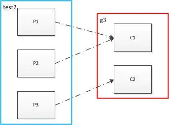
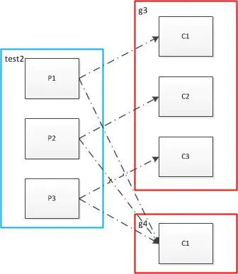
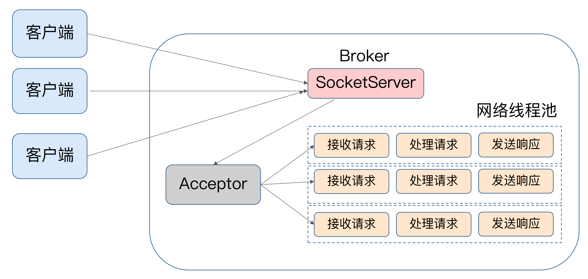
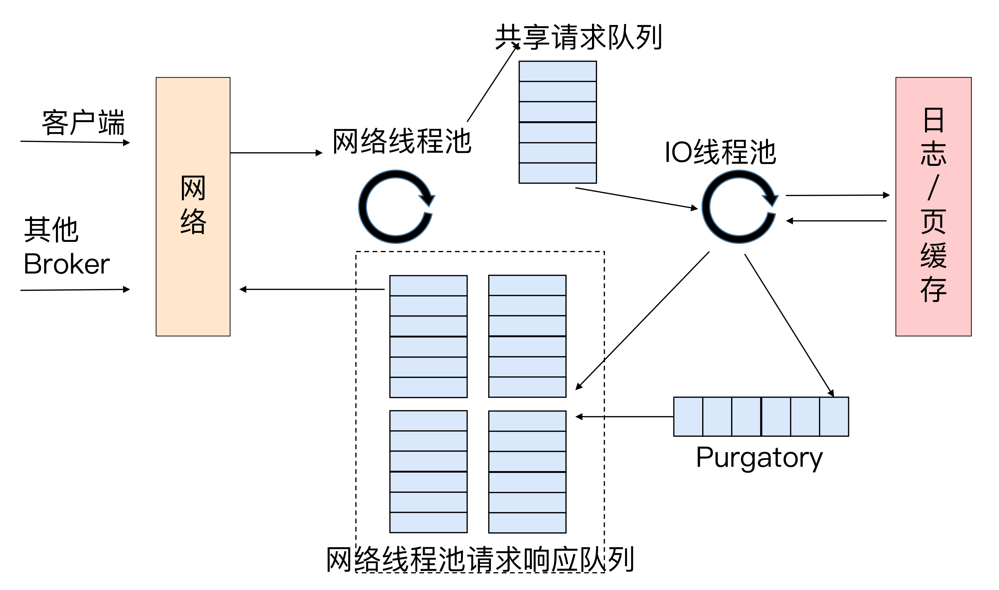
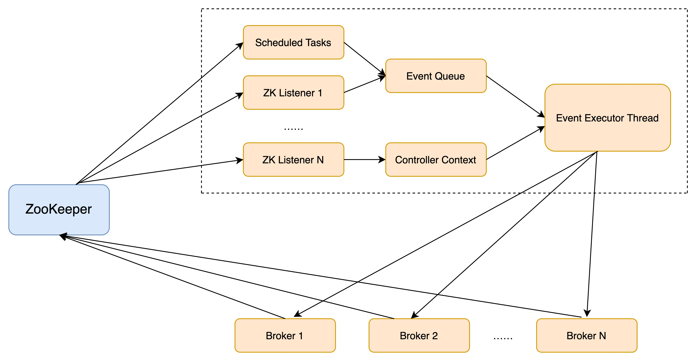
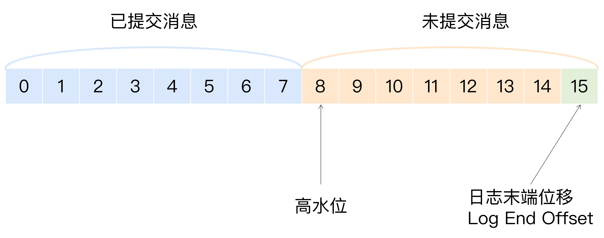

### 定义 

Apache Kafka 是一款开源的消息引擎系统,根据维基百科的定义，消息引擎系统是一组规范。企业利用这组规范在不同系统之间传递语义准确的消息，实现松耦合的异步式数据传递。

### 两种模型

- **点对点模型**：也叫消息队列模型。系统 A 发送的消息只能被系统 B 接收，其他任何系统都不能读取 A 发送的消息。日常生活的例子比如电话客服就属于这种模型：同一个客户呼入电话只能被一位客服人员处理，第二个客服人员不能为该客户服务。
- **发布 / 订阅模型**：与上面不同的是，它有一个主题（Topic）的概念，你可以理解成逻辑语义相近的消息容器。该模型也有发送方和接收方，只不过提法不同。发送方也称为发布者（Publisher），接收方称为订阅者（Subscriber）。和点对点模型不同的是，这个模型可能存在多个发布者向相同的主题发送消息，而订阅者也可能存在多个，它们都能接收到相同主题的消息。生活中的报纸订阅就是一种典型的发布 / 订阅模型。

### 为什么要用消息队列 —— “削峰填谷”

所谓的“削峰填谷”就是指缓冲上下游瞬时突发流量，使其更平滑。特别是对于那种发送能力很强的上游系统，如果没有消息引擎的保护，“脆弱”的下游系统可能会直接被压垮导致全链路服务“雪崩”。但是，一旦有了消息引擎，它能够有效地对抗上游的流量冲击，真正做到将上游的“峰”填满到“谷”中，避免了流量的震荡。消息引擎系统的另一大好处在于发送方和接收方的松耦合，这也在一定程度上简化了应用的开发，减少了系统间不必要的交互。

### 体系架构

Kafka体系架构=M个producer +N个broker +K个consumer+ZK集群

**producer**:生产者

**broker**：服务代理节点，Kafka服务实例。n个broker组成一个Kafka集群，通常一台机器部署一个Kafka实例，一个实例挂了其他实例仍可以使用，体现了高可用

**topic** ：主题

**partition**： 一个topic 可以拥有若干个partition（从 0 开始标识partition ），分布在不同的broker 上， 实现发布与订阅时负载均衡。producer 通过自定义的规则将消息发送到对应topic 下某个partition，以offset标识一条消息在一个partition的唯一性。一个partition拥有多个replica，提高容灾能力。replica 包含两种类型：leader 副本、follower副本，leader副本负责读写请求，follower 副本负责同步leader副本消息，通过副本选举实现故障转移。partition在机器磁盘上以log 体现，采用顺序追加日志的方式添加新消息、实现高吞吐量

**consumer**：消费者, 消费topic 的消息,一个topic 可以让若干个consumer消费，若干个consumer组成一个 consumer group ，一条消息只能被consumer group 中一个consumer消费，若干个partition 被若干个consumer 同时消费，达到消费者高吞吐量。

**同一个partition内的消息只能被同一个组中的一个consumer消费。当消费者数量多于partition的数量时，多余的消费者空闲。**



**启动多个组，则会使同一个消息被消费多次**



### 分区策略

**所谓分区策略是决定生产者将消息发送到哪个分区的算法**。Kafka 为我们提供了默认的分区策略，同时它也支持你自定义分区策略。

- 轮询策略： 也称 Round-robin 策略，即顺序分配。默认策略
- 随机策略： 也称 Randomness 策略。所谓随机就是我们随意地将消息放置到任意一个分区上
- 按消息键保序策略：Kafka 允许为每条消息定义消息键，简称为 Key。一旦消息被定义了 Key，那么你就可以保证同一个 Key 的所有消息都进入到相同的分区里面，由于每个分区下的消息处理都是有顺序的，故这个策略被称为按消息键保序策略
- 其他分区策略： 基于地理位置的分区策略。当然这种策略一般只针对那些大规模的 Kafka 集群，特别是跨城市、跨国家甚至是跨大洲的集群。

### Kafka的所有通信都是基于TCP协议

何时关闭TCP连接:

Producer端关闭TCP连接的方式有两种：用户主动关闭，或kafka自动关闭。

- **用户主动关闭**，通过调用producer.close()方关闭, 也包括kill -9暴力关闭。
- **Kafka自动关闭**，这与Producer端参数connection.max.idles.ms的值有关，默认为9分钟，9分钟内没有任何请求流过，就会被自动关闭。这个参数可以调整。这种方式下，TCP连接是在Broker端被关闭的，但这个连接请求是客户端发起的，对TCP而言这是被动的关闭，被动关闭会产生大量的CLOSE_WAIT连接。

### 消息交付可靠性保障

- 最多一次（at most once）：消息可能会丢失，但绝不会被重复发送。
- 至少一次（at least once）：消息不会丢失，但有可能被重复发送。
- 精确一次（exactly once）：消息不会丢失，也不会被重复发送。

Kafka 默认提供的交付可靠性保障是第二种，即**至少一次**。Kafka 也可以提供最多一次交付保障，只需要让 Producer 禁止重试即可。这样一来，消息要么写入成功，要么写入失败，但绝不会重复发送。精确一次： Kafka 社区使用幂等性 Producer 和事务型 Producer力图为 Kafka 实现精确一次处理语义所提供的工具，只是它们的作用范围是不同的。幂等性 Producer 只能保证单分区、单会话上的消息幂等性；而事务能够保证跨分区、跨会话间的幂等性。

### 消费者组的重平衡 Rebalance

1. 重平衡：本质上是一种协议，规定了消费者组下的每个消费者如何达成一致，来分配订阅topic下的每个分区。

2. 触发条件：
   a. 组成员数发生变更
   b. 订阅主题数发生变更
   c. 定阅主题分区数发生变更

3. 影响：
   Rebalance 的设计是要求所有consumer实例共同参与，全部重新分配所有用分区。并且Rebalance的过程比较缓慢，这个过程消息消费会中止。

4. rebalance的算法是啥？

   - 全员参与的分区分配策略——目前的算法，也是rebalance慢的根源
   - 粘性的分区分配策略——尽量不动没有问题的分区，重新分配有问题的分区

5. 协调者 Coordinator

   所谓协调者，在 Kafka 中对应的术语是 Coordinator，它专门为 Consumer Group 服务，负责为 Group 执行 Rebalance 以及提供位移管理和组成员管理等。具体来讲，Consumer 端应用程序在提交位移时，其实是向 Coordinator 所在的 Broker 提交位移。同样地，当 Consumer 应用启动时，也是向 Coordinator 所在的 Broker 发送各种请求，然后由 Coordinator 负责执行消费者组的注册、成员管理记录等元数据管理操作。所有 Broker 在启动时，都会创建和开启相应的 Coordinator 组件。也就是说，所有 Broker 都有各自的 Coordinator 组件。

6. rebalance能否避免？

   不能完全避免,只能最大限度的设置更为合理的参数，来避免非必要的rebalance，比如这些参数，最佳实践设置 session.timeout.ms = 6s，heartbeat.interval.ms = 2s

   1. session.timeout.ms: Consumer 实例心跳请求超时，Coordinator 就会发起rebalance
   2. heartbeat.interval.ms：Consumer发送心跳请求频率
   3. max.poll.interval.ms： Consumer 端应用程序两次调用 poll 方法的最大时间间隔，它的默认值是 5 分钟，表示你的 Consumer 程序如果在 5 分钟之内无法消费完 poll 方法返回的消息，那么 Consumer 会主动发起“离开组”的请求，Coordinator 也会开启新一轮 Rebalance。
   
7. 消费者端重平衡流程

   1. 加入组，向协调者发送JoinGroup请求,上报订阅的主题
   2. 协调者会从这些成员中选择一个担任这个消费者组的领导者,通常情况下，第一个发送JoinGroup 请求的成员自动成为领导者
   3. 协调者会把消费者组订阅信息封装进JoinGroup请求的响应中，然后发给领导者
   4. 领导统一做出分配方案后，发送SyncGroup请求。其他成员也会向协调者发送SyncGroup请求，只是请求体中并没有实际内容。为了让协调者接收分配方案，然后统一以SyncGroup 响应的方式发给所有成员

8. Broker端重平衡场景剖析
   1. 新成员入组,当协调者收到新的JoinGroup请求后，它会通过心跳请求响应的方式通知组内现有的所有成员，强制他们开启新一轮的重平衡。
   2. 组成员主动离组,消费者实例所在线程或进程调用close()方法主动通知协调者他要退出。这个场景涉及第三类请求：LeaveGroup请求。协调者收到LeaveGroup请求后，依然会以心跳响应的方式通知其他成员。
   3. 组成员崩溃离组,崩溃离组是指消费者实例出现严重故障，突然宕机导致的离组。崩溃离组是被动的，协调者通常需要等待一段时间才能感知，这段时间一般是由消费者端参数session.timeout.ms控制的。
   4. 重平衡时协调者对组内成员提交位移的处理,正常情况下，每个组内成员都会定期汇报位移给协调者。当重平衡开启时，协调者会给予成员一段缓冲时间，要求每个成员必须在这段时间内快速地上报自己的位移信息，然后在开启正常JoinGroup/SyncGroup请求发送。

### 消费的滞后程度 Lag

所谓滞后程度，就是指消费者当前落后于生产者的程度，查看Lag的命令：

`bin/kafka-consumer-groups.sh --bootstrap-server <Kafka broker连接信息 > --describe --group <group 名称 >`

### Lead指标

Kafka 消费者提供了一个名为 kafka.consumer:type=consumer-fetch-manager-metrics,client-id=“{client-id}”的 JMX 指标，里面的两个属性：records-lag-max 和 records-lead-min，它们分别表示此消费者在测试窗口时间内曾经达到的最大的 Lag 值和最小的 Lead 值。这里的 Lead 值是指消费者最新消费消息的位移与分区当前第一条消息位移的差值。很显然，Lag 和 Lead 是一体的两个方面：Lag 越大的话，Lead 就越小，反之也是同理。**一旦你监测到 Lead 越来越小，甚至是快接近于 0 了，你就一定要小心了，这可能预示着消费者端要丢消息了。**

### 副本机制

**所谓副本（Replica），本质是一个只能追加写消息的提交日志。**根据Kafka副本机制的定义，同一个分区下的所有副本保存有相同的消息序列，这些副本分散保存在不同的Broker上，从而能够对抗部分Broker宕机带来的数据不可用。

#### In-sync Replicas（ISR）同步副本

1. 追随者副本定期的异步拉取领导者副本中的数据，这存在不能和Leader实时同步的风险。
2. Kafka引入了In-sync Replicas。ISR中的副本都是于Leader同步的副本，相反，不在ISR中的追随者副本就是被认为是与Leader不同步的。
3. Leader 副本天然就在ISR中，即ISR不只是追随者副本集合，他必然包括Leader副本。甚至某些情况下，ISR只有Leade这一个副本。
4. follower副本是否与leader同步的判断标准取决于Broker端参数 replica.lag.time.max.ms参数值。默认为10秒，只要一个Follower副本落后Leader副本的时间不连续超过10秒，那么Kafka就认为该Follower副本与leader是同步的，即使此时Follower副本中保存的消息明显小于Leader副本中的消息。
5. 如果leader发现flower超过replica.lag.time.max.ms时间没有向它发起fech请求（也就是复制请求），那么leader考虑将这个flower从ISR移除。ISR是一个动态调整的集合，而非静态不变的。

#### Unclean 领导者选举（Unclean Leader Election）

1. ISR是可以动态调整的，所以会出现ISR为空的情况，由于Leader副本天然就在ISR中，如果ISR为空了，这说明Leader副本也挂掉了，Kafka需要重新选举一个新的Leader。
2. Kafka把所有不在ISR中的存活副本都会称为非同步副本。通常，非同步副本落后Leader太多，如果让这些副本做为新的Leader，就可能出现数据的丢失。在kafka中，选举这种副本的过程称为Unclean领导者选举。
3. Broker端参数unclean.leader.election.enable 控制是否允许Unclean领导者选举。开启Unclean领导者选举可能会造成数据丢失，但它使得分区Leader副本一直存在，不至于停止对外提供服务，因此提升了高可用性。禁止Unclean领导者选举的好处是在于维护了数据的一致性，避免了消息丢失，但牺牲了高可用性。

### 请求处理流程

Apache Kafka 自己定义了一组请求协议，用于实现各种各样的交互操作，比如：

1.  PRODUCE 请求是用于生产消息

2. FETCH 请求是用于消费消息

3. METADATA 请求是用于请求 Kafka 集群元数据信息的

   



Kafka 的 Broker 端有个 SocketServer 组件，对应的 Acceptor 线程和一个网络线程池。Kafka 提供了 Broker 端参数 num.network.threads，用于调整该网络线程池的线程数。其默认值是 3，表示每台 Broker 启动时会创建 3 个网络线程，专门处理客户端发送的请求，Acceptor 线程采用轮询的方式将入站请求公平地发到所有网络线程中。



当网络线程拿到请求后，它不是自己处理，而是将请求放入到一个共享请求队列中。Broker 端还有个 IO 线程池，负责从该队列中取出请求，执行真正的处理。如果是 PRODUCE 生产请求，则将消息写入到底层的磁盘日志中；如果是 FETCH 请求，则从磁盘或页缓存中读取消息。IO 线程池处中的线程才是执行请求逻辑的线程。Broker 端参数 num.io.threads 控制了这个线程池中的线程数。目前该参数默认值是 8，表示每台 Broker 启动后自动创建 8 个 IO 线程处理请求。

图中有一个叫 Purgatory 的组件，这是 Kafka 中著名的“炼狱”组件。它是用来缓存延时请求（Delayed Request）的。所谓**延时请求**，就是那些一时未满足条件不能立刻处理的请求。当请求不能立刻处理时，它就会暂存在 Purgatory 中。稍后一旦满足了完成条件，IO 线程会继续处理该请求，并将 Response 放入对应网络线程的响应队列中。

#### 请求类型

1. 数据类请求： PRODUCE 、FETCH 这类请求称为数据类请求
2. 控制类请求： LeaderAndIsr、StopReplica 这类请求称为控制类请求

 Kafka 社区实现了两类请求的分离。Kafka Broker 启动后，会在后台分别创建两套网络线程池和 IO 线程池的组合，它们分别处理数据类请求和控制类请求。至于所用的 Socket 端口，自然是使用不同的端口了，你需要提供不同的 listeners 配置，显式地指定哪套端口用于处理哪类请求。

### 控制器组件 Controller

​	控制器组件（Controller），是Apache Kafka的核心组件。它的主要作用是Apache Zookeeper的帮助下管理和协调整个Kafka集群。集群中任意一台Broker都能充当控制器的角色，但在运行过程中，只能有一个Broker成为控制器。

**产生：**
	控制器是被选出来的，Broker在启动时，会尝试去Zookeeper中创建/controller节点。Kafka当前选举控制器的规则是：第一个成功创建/controller节点的Broker会被指定为控制器。

**功能：**

1. 主题管理: 创建，删除，增加分区，执行kafka-topics脚本时,大部分的后台工作都是控制器来完成的。
2. 分区重分配：Kafka-reassign-partitions脚本提供的对已有主题分区进行细粒度的分配功能。
3. Preferred领导者选举：Kafka为了避免部分Broker负载过重而提供的一种换Leader的方案。
4. 集群成员管理: 新增Broker，Broker主动关闭，Broker宕机, 通过watch机制检查Zookeeper的/brokers/ids节点下的子节点数量变更实现
5. 数据服务：控制器上保存了最全的集群元数据信息，为其他broker提供元数据查询服务，从而更新其内存中的缓存数据。

**底层设计：**

​	0.11 版本控制器的底层设计，**把多线程的方案改成了单线程加事件队列的方案。**引入了一个事件处理线程，统一处理各种控制器事件，然后控制器将原来执行的操作全部建模成一个个独立的事件，发送到专属的事件队列中，供此线程消费。



**tips：**

​	当你觉得控制器组件出现问题时，比如主题无法删除了，或者重分区 hang 住了，你不用重启 Kafka Broker 或控制器。有一个简单快速的方式是，去 ZooKeeper 中手动删除 /controller 节点。**具体命令是 rmr /controller。**

### 高水位

**水位**：在即刻T，任意创建时间（Event Time）为T ’ ，且T’ <= T的所有事件都已经到达或被观测到，那么T就被定义为水位。（已处理的和未处理的边界）

**kafka高水位:**  在kafka中水位用于表示消息在分区中的位移或位置，高水位用于表示已提交的消息的分界线的位置，在高水位这个位置之前的消息都是已提交的，在高水位这个位置之后的消息都是未提交的。

**位移值等于高水位的消息也属于未提交消息。也就是说，高水位上的消息是不能被消费者消费的。**




**LEO**: 日志末端位移，即 Log End Offset，简写是 LEO。它表示副本写入下一条消息的位移值。

**高水位更新机制:** 

​	高水位和 LEO 是副本对象的两个重要属性。Kafka 所有副本都有对应的高水位和 LEO 值，而不仅仅是 Leader 副本。只不过 Leader 副本比较特殊，Kafka 使用 Leader 副本的高水位来定义所在分区的高水位。换句话说，分区的高水位就是其 Leader 副本的高水位。在 Leader 副本所在的 Broker 上，还保存了其他 Follower 副本的 LEO 值。**同一个副本对象，其高水位值不会大于 LEO 值。**

**Leader 副本:**

处理生产者请求的逻辑如下：

1. 写入消息到本地磁盘。

2. 更新分区高水位值:

   i. 获取 Leader 副本所在 Broker 端保存的所有远程副本 LEO 值（LEO-1，LEO-2，……，LEO-n）。

   ii. 获取 Leader 副本高水位值：currentHW。

   iii. 更新 currentHW = max{currentHW, min（LEO-1, LEO-2, ……，LEO-n）}。

处理 Follower 副本拉取消息的逻辑如下：

1. 读取磁盘（或页缓存）中的消息数据。
2. 使用 Follower 副本发送请求中的位移值更新远程副本 LEO 值。
3. 更新分区高水位值（具体步骤与处理生产者请求的步骤相同）。

**Follower 副本:**

从 Leader 拉取消息的处理逻辑如下：

1. 写入消息到本地磁盘。更新 LEO 值。

2. 更新高水位值:

   i. 获取 Leader 发送的高水位值：currentHW。

   ii. 获取步骤 2 中更新过的 LEO 值：currentLEO。

   iii. 更新高水位为 min(currentHW, currentLEO)。

**Kafka的复制协议：**

​	Kafka复制协议有两个阶段:

1. 第一阶段，follower从leader获取到消息；
2. 第二阶段，在下一轮的RPC中向leader发送fetch request确认收到消息。假设其他的follower也都确认了，那么leader会更新HW，并在接下来的RPC中响应给follower。同时，在重启一个follower时，这个follower可能会把日志截断到HW处（意味着此follower将会删除一些消息），然后从leader获取消息。

### leader epoch

正是有与Kafka的复制协议分两个阶段，导致使用高水位会出现数据丢失和数据不一致的问题。

**数据丢失：**

​	假设集群中有两台Broker，Leader为A，Follower为B。A中有两条消息m1和m2，HW为2，LEO为2；B中有两条消息m1和m2，LEO为2和HW为1.假设B重启，B 会执行日志截断操作，将LEO=HW=1，然后向A拉去消息同步，这时A宕机，B成为Leader，消息m2就丢失了

**数据不一致：**

​	假设集群中有两台Broker，Leader为A，Follower为B。A中有两条消息m1和m2，HW为1，LEO为2；B中有一条消息m1，LEO和HW都为1.假设A和B同时挂掉，然后B先醒来，成为了Leader（假设此时的min.insync.replicas参数配置为1）。然后B中写入一条消息m3，并且将LEO和HW都更新为2.然后A醒过来了，向B发送FetchrRequest，B发现A的LEO和自己的一样，都是2，就让A也更新自己的HW为2。但是其实，虽然大家的消息都是2条，可是消息的内容是不一致的。一个是(m1,m2),一个是(m1,m3)。


kafka在**0.11版本**使用leader epoch解决这两个问题。

Leader Epoch可以大致认为是：Leader版本由两部分数据组成

- Epoch
  - 一个**单调递增**的版本号
  - 每当**副本领导权发生变更**时，都会增加该版本号
  - 小版本号的Leader被认为是**过期Leader**，不能再行使Leader权利
- 起始位移（Start Offset）
  - **Leader副本**在该Epoch值上写入的**首条消息**的位移

Kafka Broker 会在内存中为每个分区都缓存 Leader Epoch 数据，同时它还会定期地将这些信息持久化到一个 checkpoint 文件中。

**概念：**

- Leader Epoch: leader纪元，单调递增的int值，每条消息都需要存储所属哪个纪元。
- Leader Epoch Start Offset: 新leader的第一个日志偏移，同时也标志了旧leader的最后一个日志偏移。
- Leader Epoch Sequence File: Leader Epoch以及Leader Epoch Start Offset的变化记录，每个节点都需要存储。
- Leader Epoch Request: 由follower请求leader，得到请求纪元的最大的偏移量。如果请求的纪元就是当前leader的纪元的话，leader会返回自己的LEO，否则返回下一个纪元的Leader Epoch Start Offset。follow会用此请求返回的偏移量来截断日志。

**如何解决上诉两个问题：**

1. 数据丢失：B重启后会去请求Leader A获取，由于纪元没变，返回LEO=2，故不需要截断，不会出现数据丢失
2. 数据不一致：B重启成为Leader，纪元变成1，A重启后请求Leader，发现纪元变更，返回变更后的Start Offset=1，小于A中的LEO=2，A开始截断，LEO=HW=1，然后同步B中的数据，最终数据变成(m1,m3)


### 常见命令

#### kafka-topics.sh:

```
// 新增主题
bin/kafka-topics.sh --bootstrap-server broker_host:port --create --topic my_topic_name --partitions 1 --replication-factor 1

// 查询主题详情
bin/kafka-topics.sh --bootstrap-server broker_host:port --describe --topic <topic_name>

// 修改主题分区
bin/kafka-topics.sh --bootstrap-server broker_host:port --alter --topic <topic_name> --partitions <新分区数>

// 修改主题消息大小
bin/kafka-configs.sh --zookeeper zookeeper_host:port --entity-type topics --entity-name <topic_name> --alter --add-config max.message.bytes=10485760

//修改主题限速
bin/kafka-configs.sh --zookeeper zookeeper_host:port --alter --add-config 'leader.replication.throttled.rate=104857600,follower.replication.throttled.rate=104857600' --entity-type brokers --entity-name 0

//修改全部主题限速
bin/kafka-configs.sh --zookeeper zookeeper_host:port --alter --add-config 'leader.replication.throttled.replicas=*,follower.replication.throttled.replicas=*' --entity-type topics --entity-name test

// 删除主题
bin/kafka-topics.sh --bootstrap-server broker_host:port --delete  --topic <topic_name>

```

#### kafka-configs.sh

```
// 全局修改unclean.leader.election.enable 参数
bin/kafka-configs.sh --bootstrap-server kafka-host:port --entity-type brokers --entity-default --alter --add-config unclean.leader.election.enable=true

// 查看配置
bin/kafka-configs.sh --bootstrap-server kafka-host:port --entity-type brokers --entity-default --describe

// 删除配置
bin/kafka-configs.sh --bootstrap-server kafka-host:port --entity-type brokers --entity-default --alter --delete-config unclean.leader.election.enable
```

#### kafka-consumer-groups.sh

```
// 查看消费Lag
bin/kafka-consumer-groups.sh --describe --bootstrap-server kafka-host:port --group test-group

// 重置位移到最早的位置
bin/kafka-consumer-groups.sh --bootstrap-server kafka-host:port --group test-group --reset-offsets --all-topics --to-earliest –execute

// 重置位移到最新的位置
bin/kafka-consumer-groups.sh --bootstrap-server kafka-host:port --group test-group --reset-offsets --all-topics --to-latest --execute

// 重置位移到指定位置
bin/kafka-consumer-groups.sh --bootstrap-server kafka-host:port --group test-group --reset-offsets --all-topics --to-offset <offset> --execute

// Current位移调整成消费者当前提交的最新位移
bin/kafka-consumer-groups.sh --bootstrap-server kafka-host:port --group test-group --reset-offsets --all-topics --to-current --execute

// 把位移调整至当前位移+N处
bin/kafka-consumer-groups.sh --bootstrap-server kafka-host:port --group test-group --reset-offsets --shift-by <offset_N> --execute

// 把位移调整至大于给定时间的最小处
bin/kafka-consumer-groups.sh --bootstrap-server kafka-host:port --group test-group --reset-offsets --to-datetime 2019-06-20T20:00:00.000 --execute	

// 把位移调整至距离当前时间指定时间间隔的位移处
bin/kafka-consumer-groups.sh --bootstrap-server kafka-host:port --group test-group --reset-offsets --by-duration PT0H30M0S --execute
```

####  bin/kafka-run-class.sh

```
// 查看主题消息总数 -1 latest， -2 earliest
// 查看最早位移位置
bin/kafka-run-class.sh kafka.tools.GetOffsetShell --broker-list kafka-host:port --time -2 --topic test-topic

// 查看最新位移位置
bin/kafka-run-class.sh kafka.tools.GetOffsetShell --broker-list kafka-host:port --time -1 --topic test-topic
```

