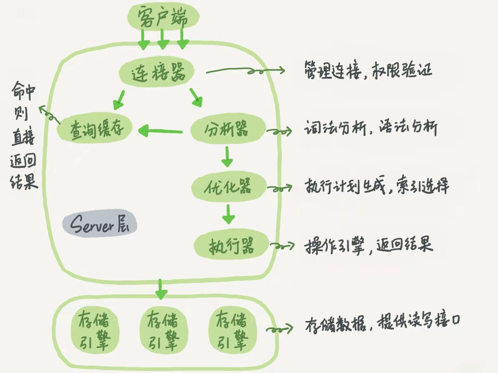

### 定义

MySQL是一个**关系型数据库管理系统**，由瑞典[MySQL AB](https://baike.baidu.com/item/MySQL AB/2620844) 公司开发，属于 [Oracle](https://baike.baidu.com/item/Oracle) 旗下产品。MySQL 是最流行的关系型数据库管理系统之一，MySQL所使用的 SQL 语言是用于访问[数据库](https://baike.baidu.com/item/数据库/103728)的最常用标准化语言。

MySQL 软件采用了双授权政策，分为社区版和商业版，由于其体积小、速度快、总体拥有成本低，尤其是开放源码这一特点，一般中小型网站的开发都选择 MySQL 作为网站数据库。

### 架构图

mysql整体架构分为server层和存储引擎层。

**server层：**包括连接器、查询缓存、分析器、优化器、执行器等，涵盖了mysql大多数核心服务功能，所有跨存储引擎的功能都是在这一层实现的，比如存储过程、触发器、视图等。

**存储引擎层:**负责数据的存储和提取，其架构模式是插件式的，支持Innodb、MyISAM、Memory等多个存储引擎。MySQL 5.5.5之后默认存储引擎Innodb。

#### 连接器

用于与客户端建立连接，获取权限，维持与管理链接。连接建立完成后，可以使用show processlist命令查看连接状况。一个连接长时间没有操作，那么连接器就会将它断开，由参数wait_timeout控制，默认8小时。

**长连接：** 连接建立成功后，客户端持续有请求，保持连接，由于连接建立过程比较耗费资源，所以使用过程中尽量减少建立连接的动作，尽量使用长连接。

- **问题：**由于mysql在执行过程中使用的临时内存是管理在连接对象中的，在连接断开之后才会释放，如果长时间不释放可能会导致内存占用太大导致OOM。
- **解决方案：** mysql 5.7之前，可以通过定期断开长连接的方式解决，5.7或者之后的版本，可以使用mysql_reset_connection 来重新初始化链接资源，这个过程是不需要重连和权限校验的。

#### 查询缓存

如果是一个查询请求，当连接建立完成后，MySQL会先查询缓存，看看之前是否执行过该语句，缓存中存在就直接返回给客户端。不存在就往后执行，执行完成后，将执行结果放入查询缓存中。

**不推荐使用查询缓存：** 由于缓存失效十分频繁，只要表中有一条修改就会直接清空整个缓存，所以查询缓存一般适合修改频率非常低的表，比如系统配置表这种。

**MySQL 8.0 删除了查询缓存模块， 从8.0之后彻底没有查询缓存**

**按需使用：** 将query_cache_type 设置为DEMAND，默认所有请求都不使用查询缓存，需要使用的时候使用SQL_CACHE方式`select SQL_CACHE * from T where id = xxx;`

#### 分析器

分析器对sql语句做词法分析，语法分析，判断语句是否正确，如果不准确，返回"ERROR 1064 (42000): You have an error in your SQL syntax"

#### 优化器

通过分析器，已经能正常解析这次请求的内容，然后会进入优化器进行优化处理，比如表中有多索引的情况决定使用哪个索引，多表关联的时候决定各个表的关联顺序

#### 执行器

MySQL通过分析器知道要做什么，通过优化器知道怎么去做，然后进入执行器开始执行语句，执行器会先判断是否有操作这个表的权限，权限校验完成后，执行器就会根据表对应的存储引擎的定义，去使用对应引擎提供的接口，将查询出来的结果集在server层做组合排序等操作后返回给客户端。

#### 存储引擎

MySQL存储引擎是插件式的，对应多种不同的存储引擎如： Innodb、MyISAM、Memory等，存储引擎会提供一系列的接口，给到server层执行，不同的存储引擎支持的能力也不相同，由于Innodb提供了比较好的事务支持，使用人数也是最多的，在MySQL 5.5 之后默认的存储引擎使用的就是Innodb。

#### 日志

MySQL日志中记录着MySQL数据库运行期间发生的变化，除了平时排查错误和记录请求之外，还有用于灾难恢复和主从复制，事务回滚等操作的日志，比较重要的三种日志： bin log、redo log、 undo log。

**binlog**: mysql server层的业务日志，记录所有的变更操作, 所有的存储引擎都可以使用，

**redo log:** 存储引擎层 innodb中的变更日志, WAL设计，修改底层数据太慢，不如直接记录操作日志，等后续再读日志修改数据，保证事务的持久性，redo log是一个固定大小的环形结构。

- write pos 是当前记录的位置

- checkpoint是最早的日志位置

- write pos 和 checkpoint之间的位置就是可以写入的新的数据的区域

  数据库中innodb_flush_log_at_trx_commit参数就控制了在事务提交时，如何将buffer中的日志数据刷新到file中.

  该参数支持三种策略：

1. 值为0：提交事务也不进行刷盘操作
2. 值为1：提交事务一次就刷盘一次（ 默认刷盘策略）
3. 值为2：每次提交事务时，只会将buffer中的内容写入页面缓存中，不会在将页面缓存中的数据刷盘到file中。

**undo log:** 存储引擎层innodb中的反向记录操作日志，提供 回滚 和 多版本并发控制(MVCC)。比如一条 delete 操作在 undo log 中会对应一条 insert 记录，反之亦然。当 update 操作时，它会记录一条相反的 update 记录。当执行 rollback 时，就可以从 undo log 中的逻辑记录读取到相应的内容并进行回滚。MVCC：当读取的某一行被其他事务锁定时，它可以从 undo log 中分析出该行记录以前的数据是什么，从而提供该行版本信息，让用户实现非锁定一致性读取。

**二阶段提交：** 为了保证bin log 和 redo log一致，innodb执行完写操作后，写入redo log进入prepare， 然后server执行器写入bin log，写入完成后innodb写入redo log进入commit。这样如果redo log 或者bin log写入过程异常重启后，就能根据bin log是否写入成功，redo log选择提交或者回滚。

事务日志落盘参数： 

1. innodb_flush_log_at_trx_commit=1，每次事务redo log都持久化到磁盘
2. sync_binlog=1，每次事务的binlog都持久化到磁盘

#### 查询流程：

1. 客户端发起连接
2. 连接器鉴定身份，管理连接
3. 查询查询缓存中是否有记录，存在就执行权限校验，是否有表权限，通过后返回给客户端
4. 如果没有命中缓存，那么进入分析器，分析器会对请求做词法分析，然后执行语法分析，判断sql是否合法。
5. 经过分析器后，MySQL已经知道要做什么了，在开始执行前， 会经过优化器处理： 当表有多个索引时候，选择使用哪个索引，多表关联的时候决定连接顺序等。
6. 经过优化器优化过后，语句执行方案就确定下来了，进入执行器阶段，执行器开始执行的时候会先判断是否有表权限，然后执行器根据表的存储引擎定义找到对应的存储引擎，调用存储引擎接口取对应的数据。然后根据请求执行一些排序处理等，封装返回格式返回。

#### 更新流程（Innodb）：

1. 客户端发起连接
2. 连接器鉴定身份，管理连接
3. 进入分析器，分析器会对请求做词法分析，然后执行语法分析，判断sql是否合法。
4. 然后清空对应表的查询缓存
5. 经过分析器后，MySQL已经知道要做什么了，在开始执行前， 会经过优化器处理： 当表有多个索引时候，选择使用哪个索引，多表关联的时候决定连接顺序等。
6. 经过优化器优化过后，语句执行方案就确定下来了，进入执行器阶段，执行器开始执行的时候会先判断是否有表权限，然后执行器根据表的存储引擎定义找到对应的存储引擎，调用存储引擎接口修改对应行的数据。
7. 存储引擎先判断该行是否在内存中，如果不在则从磁盘读入内存，修改该行数据，然后写入redo log，redo log 属于prepare状态，这时执行器会写入binlog，写入完成后，调用存储引擎接口提交事务，此时存储引擎将redo log改为commit状态。到此就更新完成

**事务隔离级别：**

| 隔离级别                   | 描述                                                         | 问题                                                         |
| -------------------------- | ------------------------------------------------------------ | ------------------------------------------------------------ |
| 读未提交(read uncommitted) | 一个事务还没提交时，它做的变更就能被别的事务看到。           | 脏读：读到没有提交的数据                                     |
| 读已提交(read committed)   | 一个事务提交之后，它做的变更才会被其他事务看到。             | 不可重复读： 同一个事务两次读同一个数据，值不一样            |
| 可重复读(repeatable read)  | 一个事务执行过程中看到的数据，总是跟这个事务在启动时看到的数据是一致的。当然在可重复读隔离级别下，未提交变更对其他事务也是不可见的。在事务启动的时候会开启一个read-view ， | 幻读： 事务A查询内容，之后事务B插入了数据，导致事务A的修改相关数据操作失败，但是查询还是不存在。 |
| 串行化(serializable)       | 顾名思义是对于同一行记录，“写”会加“写锁”，“读”会加“读锁”。当出现读写锁冲突的时候，后访问的事务必须等前一个事务执行完成，才能继续执行。 |                                                              |

**事务隔离级别实现**：数据库里面会创建一个MVCC一致性读视图(consistent read view)，访问的时候以视图的逻辑结果为准。在“可重复读”隔离级别下，这个视图是在事务启动时创建的，整个事务存在期间都用这个视图。在“读提交”隔离级别下，这个视图是在每个 SQL 语句开始执行的时候创建的。“读未提交”隔离级别下直接返回记录上的最新值，没有视图概念；而“串行化”隔离级别下直接用加锁的方式来避免并行访问。

**MVCC一致性视图实现：**

InnoDB 里面每个事务有一个唯一的事务 ID，叫作 transaction id。它是在事务开始的时候向 InnoDB 的事务系统申请的，是按申请顺序严格递增的。数据表中的一行记录，其实可能是有多个版本的，每个版本有自己的raw trx_id, 而这个多版本的方式就是undo log实现的，每次更新操作都往undo log写入反向记录，然后读取的时候依据视图来判断当前行数据是否可见，不可见执行undo log中的记录就回到了上一个版本，直到找到合法的可见值。

一个数据版本，对于一个事务视图来说，除了自己的更新总是可见以外，有三种情况：

1. 版本未提交，不可见；
2. 版本已提交，但是是在视图创建后提交的，不可见；
3. 版本已提交，而且是在视图创建前提交的，可见。

#### 索引：

**B+树：**mysql索引使用的是B+树，原因是为了减少磁盘访问次数(N叉树)和能够范围查询(B+树)。mysql设置一个节点大小为16K(一页)，假设bigint索引，就算叶子节点只放一行数据(16K),那么3层高的树可以放136w的数据，正常情况下一行数据远达不到16K，假设一行数据1K，那么三层可以放下2190w的数据。计算方式： bigint索引8个字节，指针6个字节，所以一页可以放16  * 1024 / (8 + 6) = 1170个数据，3层高的树，最下一层放数据，那么可以放下的索引个数为： 1170 *1170 *一页可以存储的行数。由于根节点的叶肯定在内存中，所以2000w的数据也只用访问两次磁盘就能获取到对应数据。

**主键索引、聚簇索引：**主键索引的叶子节点存的是整行数据。在 InnoDB 里，主键索引也被称为聚簇索引（clustered index）

**非主键索引、二级索引：**非主键索引的叶子节点内容是主键的值。在 InnoDB 里，非主键索引也被称为二级索引（secondary index），由于查询到的值还需要去主键索引的树中根据id查询剩余列的数据，这个过程称之为**回表**，所以非主键索引也称为二级索引

**唯一索引：** 索引的key只有一个，不会重复，所以树查找到第一个值的时候不会往后继续遍历，而是直接停止。

**全文索引：** 倒排索引原理，利用分词器将一个语句分成多个词的索引。速度比like要快，但是性能是瓶颈。如果有需求不妨使用es

**组合索引：** 多个字段组成一个索引，称为组合索引

**覆盖索引：**指的是查询索引的时候如果查询的字段就是索引的key或者value，那么就不会有回表操作，这种情况称为覆盖索引

**最左前缀：**索引key匹配是从左到右的，所以如果有个组合索引(a,b), 那么就没有必要建立a的索引了，但是单独查询b的索引还是需要建立的

**索引下推：** mysql5.6引入,语句select * from t where a like "xxx%" and b > 10，有组合索引(a,b) 根据最左前缀匹配所有a=xxx前缀的值，如果是mysql5.6之前，只能将这些匹配的值都回表去主键索引中查询并判断b是否>10. mysql5.6之后引入索引下推，就可以直接根据索引中的b字段判断b是否>10，然后再去回表，可以减少回表次数。

#### 锁

根据加锁范围，mysql中锁可以分为全局锁，表级锁，行锁。

**全局锁：** 全局锁就是对整个数据库实例加锁。MySQL 提供了一个加全局读锁的方法，命令是 Flush tables with read lock (FTWRL)。当你需要让整个库处于只读状态的时候，可以使用这个命令，之后其他线程的以下语句会被阻塞：数据更新语句（数据的增删改）、数据定义语句（包括建表、修改表结构等）和更新类事务的提交语句。

**表级锁：** MySQL 里面表级别的锁有两种：一种是**表锁**，一种是**元数据锁**（meta data lock，MDL)

- **表锁**: 表锁的语法是 lock tables … read/write。与 FTWRL 类似，可以用 unlock tables 主动释放锁，也可以在客户端断开的时候自动释放。
- **元数据锁：** MDL 不需要显式使用，在访问一个表的时候会被自动加上。在 MySQL 5.5 版本中引入了 MDL，当对一个表做增删改查操作的时候，加 MDL 读锁；当要对表做结构变更操作的时候，加 MDL 写锁。

**行锁：** 行锁是在引擎层由各个引擎自己实现的， MyISAM就不支持行锁。在 InnoDB 事务中，行锁是在需要的时候才加上的，但并不是不需要了就立刻释放，而是要等到事务结束时才释放。**如果你的事务中需要锁多个行，要把最可能造成锁冲突、最可能影响并发度的锁尽量往后放。**

**间隙锁: ** innodb 中可重复读隔离级别中，在一个事务中，为了防止看到其他事务新插入的数据，引入了间隙锁，如果只加行锁是没有办法锁住新插入的数据的，所以还需要锁住扫描到的字段之间的间隙。这样查询出来的结果就看不到其他事务的数据了，满足可重复读的隔离级别。间隙锁是基于**扫描到的字段往前的间隙**，比如一个字段[1, 3, 5, 7, 8]. 这个时候扫描到5这个字段，那么锁住的就是(3,5)这个间隙，但是如果过程中3被删除了，空隙锁锁住的就是(1,5) 这个间隙了。

**next-key lock：** 间隙锁和行锁合称 next-key lock，每个 next-key lock 是前开后闭区间。

**加锁规则：** 包含了两个“原则”、两个“优化”和一个“bug”。

- 原则 1：加锁的基本单位是 next-key lock。next-key lock 是前开后闭区间。
- 原则 2：查找过程中访问到的对象才会加锁。
- 优化 1：索引上的等值查询，给唯一索引加锁的时候，next-key lock 退化为行锁。
- 优化 2：索引上的等值查询，向右遍历时且最后一个值不满足等值条件的时候，next-key lock 退化为间隙锁。
- 一个 bug：唯一索引上的范围查询会访问到不满足条件的第一个值为止。

**死锁解决方案：**

- **超时检测：**一个事务超时直接回滚，超时时间可以通过参数 innodb_lock_wait_timeout 来设置，默认50s。
- **死锁检测：** mysql定期发起死锁检测，发现死锁后，主动回滚死锁链条中的某一个事务，让其他事务得以继续执行。将参数 innodb_deadlock_detect 设置为 on，表示开启这个逻辑。死锁检测要耗费大量的 CPU 资源，所以需要慎用。
