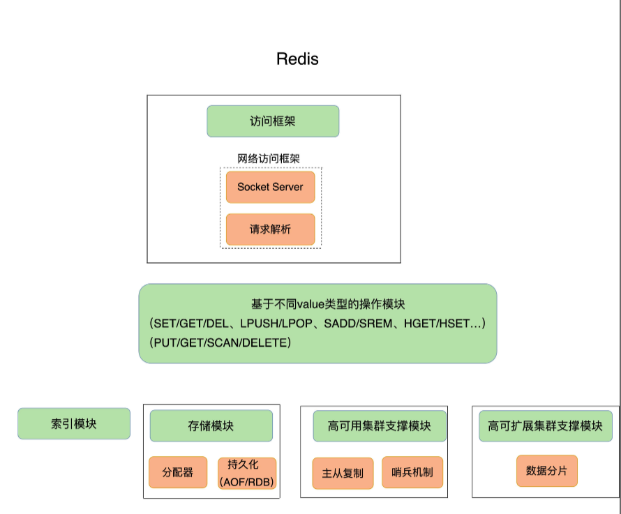
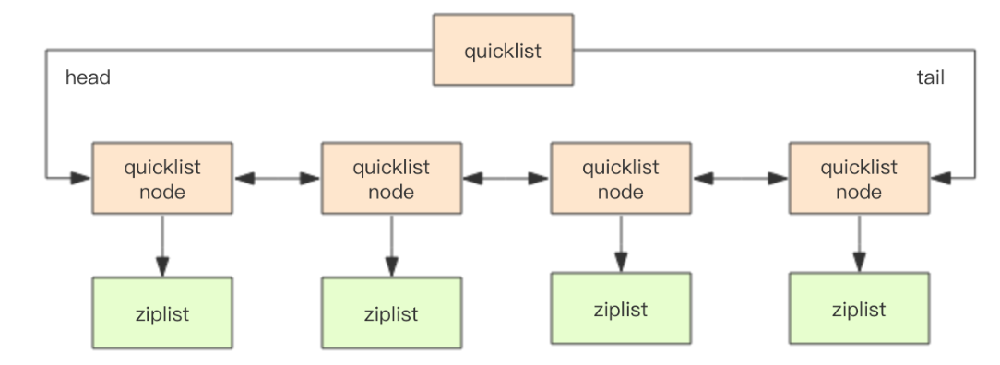
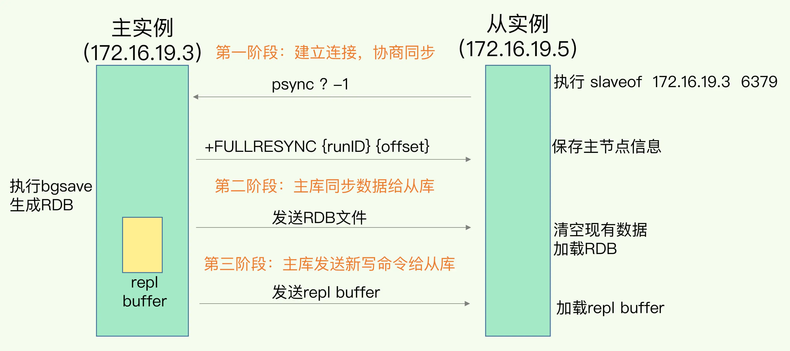

### 定义

**Redis**是一个使用[ANSI C](https://zh.wikipedia.org/wiki/ANSI_C)编写的[开源](https://zh.wikipedia.org/wiki/开源)、支持[网络](https://zh.wikipedia.org/wiki/电脑网络)、基于[内存](https://zh.wikipedia.org/wiki/内存)、[分布式](https://zh.wikipedia.org/wiki/分布式缓存)、可选[持久性](https://zh.wikipedia.org/w/index.php?title=持久性_(数据库)&action=edit&redlink=1)的[键值对存储数据库](https://zh.wikipedia.org/wiki/键值-值数据库)

### 知识全景图

那么，所谓的 Redis 知识全景图都包括什么呢？简单来说，就是“两大维度，三大主线”。

“两大维度”就是指系统维度和应用维度，“三大主线”也就是指高性能、高可靠和高可扩展。

- 高性能主线，包括线程模型、数据结构、持久化、网络框架；

- 高可靠主线，包括主从复制、哨兵机制；

- 高可扩展主线，包括数据分片、负载均衡。

### 架构

一个键值数据库包括了**访问框架**、**索引模块**、**操作模块**和**存储模块**四部分。

- **访问框架**：通过网络框架以 Socket 通信的形式对外提供键值对操作，这种形式可以提供广泛的键值存储服务。在上图中，我们可以看到，网络框架中包括 Socket Server 和协议解析。
- **操作模块**： 封装对键值操作的接口
- **索引模块**： **索引的作用是让键值数据库根据 key 找到相应 value 的存储位置，进而执行操作。**索引的类型有很多，常见的有哈希表、B+ 树、字典树等。不同的索引结构在性能、空间消耗、并发控制等方面具有不同的特征。Redis采用**哈希表**作为索引，很大一部分原因在于，其键值数据基本都是保存在内存中的，而内存的高性能随机访问特性可以很好地与哈希表 O(1) 的操作复杂度相匹配。Redis 的 value 支持多种类型，当我们通过索引找到一个 key 所对应的 value 后，仍然需要从 value 的复杂结构（例如集合和列表）中进一步找到我们实际需要的数据，Redis 采用一些常见的高效索引结构作为某些 value 类型的底层数据结构，这一技术路线为 Redis 实现高性能访问提供了良好的支撑。

- **存储模块** : 提供多种分配器，用于内存分配，持久化模块能支持两种方式，日志（AOF）和快照（RDB）。

### Redis的数据结构和实现

基础数据结构： string，list，set，sortset，hash

拓展数据类型： bitmap，HyperLogLog，GEO

- **字符串**： 字符串类型的内部编码有3种, redis会根据当前值的类型和长度决定使用那种内部实现：
  
  - int：8字节的长整形
  - embstr：小于等于39字节的字符串
  - raw：大于39字节的字符串
  
  底层由简单动态字符串(Simple Dynamic String, SDS) len+alloc+buf字节数组组成:
  
  - len: 4个字节，表示 buf 的已用长度。
  - alloc: 4个字节，表示 buf 的实际分配长度
  - buf: 字节数组保存实际数据,'\0'结尾
  
- **列表：** 早期列表类型的内部编码有2种：

  - ziplist：压缩列表。为了节省空间,数组每个元素都要占同样大小，压缩列表记录每个元素长度就能使用更少的空间保存数据，当元素数量小于list-max-ziplist-entries（默认512）时、同时所有值小于list-max-ziplist-value（默认64）字节时，Redis会使用ziplist作为列表的内部实现。注：**此规则在v6.2版本已放弃**
  - **linkedlist**：当列表类型无法满足ziplist的条件时，Redis会使用linkedlist作为列表的内部实现。

  但是目前已经完全采用**quicklist**代替。quicklist可简述为：

  

  其中，在quicklist中有两个关键的概配置项：

    - `list-max-ziplist-size `：ziplist长度，默认为8Kb
    - `compress-depth`：压缩深度，默认为0，表示不压缩

- **集合:**集合类型的内部编码有2种：

  - **intset**：整数集合。一个由整数组成的集合，与ziplist类似，对于大整数和小整数（按绝对值）采取了不同的编码，尽量对内存的使用进行了优化。当集合中的元素都是整数，且元素个数小于**set-max-intset-entries**（默认512）时，Redis会使用intset作为集合的内部实现。

  - **hashtable**：哈希表。当集合类型无法满足intset条件时，Redis会使用hashtable作为集合的内部实现。

- **有序集合:** 有序集合的内部编码有2种：

    - **ziplist**：压缩列表。当有序集合的元素个数小于**zset-max-ziplist-entries**（默认128个），同时每个元素的值都小于**zset-max-ziplist-value**（默认64字节）时，Redis会用ziplist来作为有序集合的内部实现。

    - **skiplist**：跳跃表。利用多层索引实现类似二分和平衡树的查找效率，并且可以满足范围查询。当不满足ziplist条件时，有序集合会使用skiplist作为内部实现。

- **哈希**：哈希类型的内部编码有2种：

  - **ziplist**：压缩列表。当元素数量小于**hash-max-ziplist-entries**（默认512）时、同时所有值小于**hash-max-ziplist-value**（默认64）字节时，Redis会使用ziplist作为哈希的内部实现。ziplist使用更加紧凑的结构实现多个元素的连续存储，比较节省内存。

  - **hashtable**：哈希表。当无法满足ziplist的要求是，转用hashtable作为其内部实现。

    Redis采用链式哈希解决冲突。触发Hash扩容条件时，采用**渐进式Rehash**的方式进行数据迁移。

    - 扩容条件：元素总数超过Buckets数量时，就会触发扩容条件
    - 缩容条件：元素总数少于Bucket数量的10%时，就会触发缩容条件

- **bitmap:** 底层使用string类型实现，string底层的buf就是字节数组

- **HyperLogLog:**  是一种用于统计基数的数据集合类型, HyperLogLog 的统计规则是基于概率完成的，所以它给出的统计结果是有一定误差的，标准误算率是 0.81%。

- **GEO:** 可以记录经纬度形式的地理位置信息，被广泛地应用在 LBS 服务中。GEO 本身并没有设计新的底层数据结构，而是直接使用了 Sorted Set 集合类型。GEO使用 GeoHash 编码方法实现了经纬度到 Sorted Set 中元素权重分数的转换。

### redis 单线程模型

redis采用的是单线程模型，但是仍然有着每秒数十万的处理能力，这是 Redis 多方面设计选择的一个综合结果。一方面，Redis 的大部分操作在**内存**上完成，再加上它采用了高效的数据结构，例如哈希表和跳表，这是它实现高性能的一个重要原因。另一方面，就是 Redis 采用了**多路复用机制**，使其在网络 IO 操作中能并发处理大量的客户端请求，实现高吞吐率。

#### Linux 多路复用

Linux 中的 IO 多路复用机制是指一个线程处理多个 IO 流，就是我们经常听到的 select/epoll 机制。简单来说，在 Redis 只运行单线程的情况下，该机制允许内核中，同时存在多个监听套接字和已连接套接字。内核会一直监听这些套接字上的连接请求或数据请求。一旦有请求到达，就会交给 Redis 线程处理，这就实现了一个 Redis 线程处理多个 IO 流的效果。

#### Redis IO 模型

下图就是基于多路复用的 Redis IO 模型。图中的多个 FD 就是刚才所说的多个套接字。Redis 网络框架调用 epoll 机制，让内核监听这些套接字。此时，Redis 线程不会阻塞在某一个特定的监听或已连接套接字上，也就是说，不会阻塞在某一个特定的客户端请求处理上。正因为此，Redis 可以同时和多个客户端连接并处理请求，从而提升并发性。

Redis单线程处理IO请求性能瓶颈：操作bigkey、范围操作、记录日志等。由于单线程单个请求处理时间过长会阻塞其他操作。

### Redis 持久化

Redis 的持久化主要有两大机制，即 AOF（Append Only File）日志和 RDB 快照。

#### AOF 日志

Redis 是先执行命令，把数据写入内存，然后才记录日志。redis重启后可以回放AOF日志。

优势：

	1. 可以避免出现记录错误命令的情况。
	2. 命令执行后才记录日志，不会阻塞当前的写操作。

风险： 

	1. 执行完一个命令，还没有来得及记日志就宕机了，那么这个命令和相应的数据就有丢失的风险。 
	2. AOF 虽然避免了对当前命令的阻塞，但可能会给下一个操作带来阻塞风险

##### 三种写回策略

	- Always，同步写回：每个写命令执行完，立马同步地将日志写回磁盘；
	- Everysec，每秒写回：每个写命令执行完，只是先把日志写到 AOF 文件的内存缓冲区，每隔一秒把缓冲区中的内容写入磁盘；
	- No，操作系统控制的写回：每个写命令执行完，只是先把日志写到 AOF 文件的内存缓冲区，由操作系统决定何时将缓冲区内容写回磁盘。最长的同步周期为30s

##### AOF 重写机制

​	为了避免日志文件过大，Redis 还提供了 AOF 重写机制。AOF 重写机制就是在重写时，当一个键值对被多条写命令反复修改时，AOF 文件会记录相应的多条命令， redis根据这个键值对当前的最新状态，为它生成对应的写入命令。将多条命令变成一条，实现日志变小的效果。
​	
​	和 AOF 日志由主线程写回不同，重写过程是由主线程fork出的后台子进程 bgrewriteaof 来完成的，这也是为了避免阻塞主线程，导致数据库性能下降。每次 AOF 重写时，Redis 会先执行一个内存拷贝，用于重写；然后，使用两个日志保证在重写过程中，新写入的数据不会丢失。而且，因为 Redis 采用额外的线程进行数据重写，所以，这个过程并不会阻塞主线程。

#### RDB快照

用 AOF 方法进行故障恢复的时候，需要逐一把操作日志都执行一遍。如果操作日志非常多，Redis 就会恢复得很缓慢，影响到正常使用。为了快速恢复，我们使用另一种持久化方法：内存快照。所谓内存快照，就是指内存中的数据在某一个时刻的状态记录。

Redis 提供了两个命令来生成 RDB 文件，分别是 save 和 bgsave。

- save：在主线程中执行，会导致阻塞；
- bgsave：创建一个子进程，专门用于写入 RDB 文件，避免了主线程的阻塞，这也是 Redis RDB 文件生成的默认配置。

##### 写时复制（Copy-On-Write, COW）

bgsave方式为了避免阻塞，Redis 就会借助操作系统提供的写时复制技术（Copy-On-Write, COW），在执行快照的同时，正常处理写操作。bgsave 子进程是由主线程 fork 生成的，可以共享主线程的所有内存数据。主线程 fork 出 bgsave 子进程后，bgsave 子进程实际是复制了主线程的页表。这些页表中，就保存了在执行 bgsave 命令时，主线程的所有数据块在内存中的物理地址。这样一来，bgsave 子进程生成 RDB 时，就可以根据页表读取这些数据，再写入磁盘中。如果此时，主线程接收到了新写或修改操作，那么，主线程会使用写时复制机制。具体来说，写时复制就是指，主线程在有写操作时，才会把这个新写或修改后的数据写入到一个新的物理地址中，并修改自己的页表映射。

缺点： RDB快照可以快速恢复，但是快照频率不宜过多，所以如果系统宕机，数据丢失的数量就会比较多。

#### 融合AOF和RDB方式

Redis 4.0 中提出了一个混合使用 AOF 日志和内存快照的方法。简单来说，内存快照以一定的频率执行，在两次快照之间，使用 AOF 日志记录这期间的所有命令操作。

### 主从复制

Redis 提供了主从库模式，以保证数据副本的一致，主从库之间采用的是读写分离的方式。只有主库才能执行写操作，主库和从库都能进行读操作。

#### 同步机制

##### 全量复制

psync 命令包含了主库的 runID 和复制进度 offset 两个参数

- runID: 是每个 Redis 实例启动时都会自动生成的一个随机 ID，用来唯一标记这个实例。当从库和主库第一次复制时，因为不知道主库的 runID，所以将 runID 设为“？”
- offset: 此时设为 -1，表示第一次复制。

主库收到 psync 命令后，会用 FULLRESYNC 响应命令带上两个参数：主库 runID 和主库目前的复制进度 offset，返回给从库。

- FULLRESYNC 表示全量复制

然后主库会生成RDB文件，发送给从库，从库清空数据，加载RDB文件。为了保证主从库的数据一致性，主库会在内存中用专门的 replication buffer，记录 RDB 文件生成后收到的所有写操作。然后在第三阶段发送给从库，完成同步。

##### 增量复制

从 Redis 2.8 开始，网络断了之后，主从库会采用增量复制的方式继续同步，全量复制是同步所有数据，而增量复制只会把主从库网络断连期间主库收到的命令，同步给从库。	

1. 当主从库断连后，主库会把断连期间收到的写操作命令，写入 replication buffer，同时也会把这些操作命令也写入 repl_backlog_buffer 这个缓冲区。

2. repl_backlog_buffer 是一个环形缓冲区，主库会记录自己写到的位置，从库则会记录自己已经读到的位置。(因为是环形，一旦从库断连过久，可能会导致从库无法跟上主库，只能全量复制，该大小通过repl_backlog_size参数配置)

3. repl_backlog_buffer是所有从库共享的，slave_repl_offset是由从库自己记录的，这也是因为每个从库的复制进度不一定相同。

4. 从库断连后再恢复时，会给主库发送psync命令，并把自己当前的slave_repl_offset发给主库，主库发送后续的日志给从库，完成同步。

   

一旦主从库完成了同步，它们之间就会一直维护一个网络连接，主库会通过这个连接将后续陆续收到的命令操作再同步给从库，这个过程也称为基于长连接的命令传播，可以避免频繁建立连接的开销。

### 哨兵机制
在 Redis 主从集群中，哨兵其实就是一个运行在特殊模式下的 Redis 进程，主从库实例运行的同时，它也在运行。哨兵主要负责的就是三个任务：监控、选主（选择主库）和通知。

#### 监控
1. 哨兵进程会使用 PING 命令检测它自己和主、从库的网络连接情况，用来判断实例的状态。
2. 如果哨兵发现主库或从库对 PING 命令的响应超时了，那么，哨兵就会先把它标记为“主观下线”。
3. 如果是主库标记为主观下线，该哨兵会询问其他哨兵，如果多数哨兵(可配置)都认为主库下线，那么主库会标记为“客观下线”。
4. 某个哨兵标记主库为客观下线后，这个哨兵可以再给其他哨兵发送命令，表明希望由自己来执行主从切换，并让所有其他哨兵进行投票。这个投票过程称为“Leader 选举”，在投票过程中，任何一个想成为 Leader 的哨兵，要满足两个条件：第一，拿到半数以上的赞成票；第二，拿到的票数同时还需要大于等于哨兵配置文件中的 quorum 值
5. 某个哨兵成为Leader后，就由这个哨兵开启选主流程。
#### 选主
哨兵选择新主库的过程称为“筛选 + 打分”。简单来说，我们在多个从库中，先按照一定的筛选条件，把不符合条件的从库去掉。然后，我们再按照一定的规则，给剩下的从库逐个打分，将得分最高的从库选为新主库

1. 筛选出所有在线且网络状态良好(down-after-milliseconds断连在10次以内)的从库
2. 分别按照从库优先级（slave-priority 配置）、从库复制进度（slave_repl_offset最高的）以及从库 ID 号规则依次进行三轮打分。如果优先级一样，则进入下一轮打分，直到选出分数最高的。

#### 通知

在执行通知任务时，哨兵会把新主库的连接信息发给其他从库，让它们执行 replicaof 命令，和新主库建立连接，并进行数据复制。同时，哨兵会把新主库的连接信息通知给客户端，让它们把请求操作发到新主库上。

### 切片集群（Redis Cluster）

redis3.0上加入了cluster模式，实现的redis的分布式存储，也就是说每台redis节点上存储不同的内容，适合海量数据存储。

Redis-Cluster采用无中心结构,它的特点如下：

- 所有的redis节点彼此互联(PING-PONG机制),内部使用二进制协议优化传输速度和带宽。
- 节点的fail是通过集群中超过半数的节点检测失效时才生效。
- 客户端与redis节点直连,不需要中间代理层.客户端不需要连接集群所有节点,连接集群中任何一个可用节点即可。

#### 工作方式

在redis的每一个节点上，都有这么两个东西，一个是插槽（slot），它的的取值范围是：0-16383。还有一个就是cluster，可以理解为是一个集群管理的插件。当我们的存取的key到达的时候，redis会根据crc16的算法得出一个结果，然后把结果对 16384 求余数，这样每个 key 都会对应一个编号在 0-16383 之间的哈希槽，通过这个值，去找到对应的插槽所对应的节点，然后直接自动跳转到这个对应的节点上进行存取操作。

为了保证高可用，`redis-cluster`集群引入了主从模式，一个主节点对应一个或者多个从节点，当主节点宕机的时候，就会启用从节点。当其它主节点ping一个主节点A时，如果半数以上的主节点与A通信超时，那么认为主节点A宕机了。如果主节点A和它的从节点A1都宕机了，那么该集群就无法再提供服务了。

#### 重定向机制

客户端给一个实例发送数据读写操作时，这个实例上并没有相应的数据，这个实例会返回数据所在的实例ip地址，客户端要再给一个新实例发送操作命令获取数据。

### 发布订阅机制

Redis 提供的 pub/sub 机制，也就是发布 / 订阅机制。主库上有一个名为“__sentinel__:hello”的频道，不同哨兵就是通过它来相互发现，实现互相通信的。然后哨兵向主库发送 INFO 命令，得知从库信息。列举一些常用的频道：

### 缓存

#### 缓存淘汰策略

redis有八种缓存淘汰策略： noeviction、volatile-random、volatile-ttl、volatile-lru、volatile-lfu(4.0之后新增)、allkeys-lru、allkeys-random、allkeys-lfu(4.0之后新增)

- noeviction： 不淘汰（4.0之后默认值，之前volatile-lru）
- volatile-random： 设置过期时间的数据随机淘汰
- volatile-ttl：根据过期时间顺序先后淘汰
- volatile-lru：设置过期时间根据LRU算法淘汰
- volatile-lfu：设置过期时间根据LFU算法淘汰
- allkeys-lru： 所有数据根据LRU算法淘汰
- allkeys-random：所有数据随机淘汰
- allkeys-lfu： 所有数据根据LFU算法淘汰

#### Redis LRU

在 Redis 中，LRU 算法被做了简化，以减轻数据淘汰对缓存性能的影响。Redis 在决定淘汰的数据时，第一次会随机选出 N 个数据，把它们作为一个候选集合。接下来，Redis 会比较这 N 个数据的 lru 字段，把 lru 字段值最小的数据从缓存中淘汰出去。当需要再次淘汰数据时，Redis 需要挑选数据进入第一次淘汰时创建的候选集合。这儿的挑选标准是：能进入候选集合的数据的 lru 字段值必须小于候选集合中最小的 lru 值。当有新数据进入候选数据集后，如果候选数据集中的数据个数达到了 maxmemory-samples，Redis 就把候选数据集中 lru 字段值最小的数据淘汰出去。

- Redis 是用 RedisObject 结构来保存数据的，RedisObject 结构中设置了一个 lru 字段，用来记录数据的访问时间戳；

- Redis 并没有为所有的数据维护一个全局的链表，而是通过随机采样方式，选取一定数量（例如 10 个）的数据放入候选集合，后续在候选集合中根据 lru 字段值的大小进行筛选。

#### Redis LFU

LFU 缓存策略是在 LRU 策略基础上，为每个数据增加了一个计数器，来统计这个数据的访问次数。当使用 LFU 策略筛选淘汰数据时，首先会根据数据的访问次数进行筛选，把访问次数最低的数据淘汰出缓存。如果两个数据的访问次数相同，LFU 策略再比较这两个数据的访问时效性，把距离上一次访问时间更久的数据淘汰出缓存。

Redis 在实现 LFU 策略的时候，只是把原来 24bit 大小的 lru 字段，又进一步拆分成了两部分。

- ldt 值：lru 字段的前 16bit，表示数据的访问时间戳；
- counter 值：lru 字段的后 8bit，表示数据的访问次数。

当 LFU 策略筛选数据时，Redis 会在候选集合中，根据数据 lru 字段的后 8bit 选择访问次数最少的数据进行淘汰。当访问次数相同时，再根据 lru 字段的前 16bit 值大小，选择访问时间最久远的数据进行淘汰。

LRU 策略更加关注数据的时效性，而 LFU 策略更加关注数据的访问频次。

#### 缓存雪崩
**描述**
	缓存雪崩是指大量的应用请求无法在 Redis 缓存中进行处理，紧接着，应用将大量请求发送到数据库层，导致数据库层的压力激增。

**解决方案**

- 缓存中有大量数据同时过期，导致大量请求直接发往数据库

  1. 微调过期时间,避免大量数据同时过期
  2. 服务降级
     - 当业务应用访问的是非核心数据（例如电商商品属性）时，暂时停止从缓存中查询这些数据，而是直接返回预定义信息、空值或是错误信息；
     - 当业务应用访问的是核心数据（例如电商商品库存）时，仍然允许查询缓存，如果缓存缺失，也可以继续通过数据库读取。

- redis宕机,导致大量请求直接发往数据库
  1. 服务熔断
     - 所谓的服务熔断，是指在发生缓存雪崩时，为了防止引发连锁的数据库雪崩，甚至是整个系统的崩溃，我们暂停业务应用对缓存系统的接口访问。

#### 缓存击穿

**描述**

缓存击穿是指，针对某个访问非常频繁的热点数据的请求，无法在缓存中进行处理，紧接着，访问该数据的大量请求，一下子都发送到了后端数据库，导致了数据库压力激增，会影响数据库处理其他请求。

**解决方案**

对于访问特别频繁的热点数据，不设置过期时间。

#### 缓存穿透

**描述**

缓存穿透是指要访问的数据既不在 Redis 缓存中，也不在数据库中，导致请求在访问缓存时，发生缓存缺失，再去访问数据库时，发现数据库中也没有要访问的数据。此时，应用也无法从数据库中读取数据再写入缓存，来服务后续请求，这样一来，缓存也就成了“摆设”，如果应用持续有大量请求访问数据，就会同时给缓存和数据库带来巨大压力

**解决方案**

- 业务层误操作：缓存中的数据和数据库中的数据被误删除了，所以缓存和数据库中都没有数据
  1. 一旦发生缓存穿透，我们就可以针对查询的数据，在 Redis 中缓存一个空值或是和业务层协商确定的缺省值（例如，库存的缺省值可以设为 0）。紧接着，应用发送的后续请求再进行查询时，就可以直接从 Redis 中读取空值或缺省值，返回给业务应用了，避免了把大量请求发送给数据库处理，保持了数据库的正常运行。
- 恶意攻击：专门访问数据库中没有的数据
  1. 使用布隆过滤器快速判断数据是否存在，避免从数据库中查询数据是否存在，减轻数据库压力。

##### 布隆过滤器

布隆过滤器由一个初值都为 0 的 bit 数组和 N 个哈希函数组成，可以用来快速判断某个数据是否存在。当我们想标记某个数据存在时（例如，数据已被写入数据库），布隆过滤器会通过三个操作完成标记：

- 首先，使用 N 个哈希函数，分别计算这个数据的哈希值，得到 N 个哈希值。
- 然后，我们把这 N 个哈希值对 bit 数组的长度取模，得到每个哈希值在数组中的对应位置。
- 最后，我们把对应位置的 bit 位设置为 1，这就完成了在布隆过滤器中标记数据的操作。如果数据不存在（例如，数据库里没有写入数据），我们也就没有用布隆过滤器标记过数据，那么，bit 数组对应 bit 位的值仍然为 0。

当需要查询某个数据时，我们就执行刚刚说的计算过程，先得到这个数据在 bit 数组中对应的 N 个位置。紧接着，我们查看 bit 数组中这 N 个位置上的 bit 值。只要这 N 个 bit 值有一个不为 1，这就表明布隆过滤器没有对该数据做过标记，所以，查询的数据一定没有在数据库中保存。

### 过期删除策略

- 单机

  Redis对于设置了到期时间的Key放置在一个单独的Hash中，采用**定时扫描** + **惰性删除**的策略进行管理。

  - 定时扫描

    Redis会每秒进行10次过期扫描，过期扫描采用了一种简单的贪心算法：

    1. 从过期Hash中随机获取20个Key
    2. 删除这20个Key中已经过期的Key
    3. 如果过期Key的数量超过1/4，重复步骤1

    为了防止**过度循环**，单次扫描的处理时间上限为25ms

  - 惰性删除

    客户端在访问这个Key时，Redis会对Key的过期时间进行检查，如果过期了，就立刻删除

- 集群

  从库不会进行过期扫描，从库对过期的处理是被动的。主库在 key 到期时，会在 AOF 文件里增加一条 del 指令，同步到所有的从库，从库通过执行这条 del 指令来删除过期的 key。因为从库的删除过程是异步的，所以在读写分离的情况下，就会出现**读到过期数据**的问题。