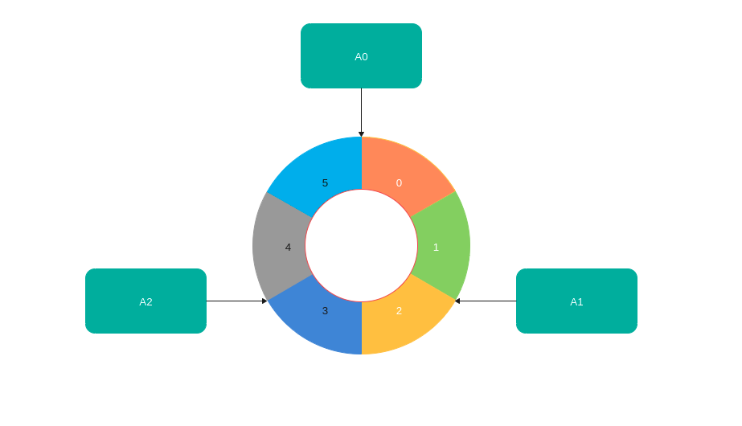

## 前言

分布式系统中, 数据往往具有海量的数据需要存储到多台机器中，这些海量的数据需要一个规则来划分到不同机器上去存储，其中一种最常见的数据分布方式：哈希

## 简单哈希

哈希是按照数据的某一特征值进行计算哈希值，然后将哈希值与机器相互对应，从而将不同哈希值的数据放到不同的机器上。

比如有一组数据：

<table>
	<tr>
        <td>5</td>
        <td>13</td>
        <td>16</td>
        <td>19</td>
        <td>24</td>
        <td>37</td>
        <td>29</td>
        <td>9</td>
        <td>38</td>
        <td>50</td>
    <tr>
</table>

我们只有三台机器A0, A1, A2，需要将数据放到不同的机器中，最简单的哈希函数就是将数据直接取模3,就可以得到下列的数据分布：

| A0   | A1   | A2   |
| ---- | ---- | ---- |
| 24   | 13   | 5    |
| 9    | 16   | 29   |
|      | 19   | 38   |
|      | 37   | 50   |

这就是一种简单的hash方式，理论上来讲，只要hash函数的散列特性较好，就能够将数据均匀的分布到不同的机器上，上述哈希函数有两个比较明显的缺点： 

1. **拓展性不强**， 如果我们新增一台机器，那么所有数据都需要全部重新hash，当然可以用一台机器来维护之前的记录，之后的数据就使用新的机器数取模，这种方式成本仍然太高，也不利于维护。
2. **数据倾斜**，取模的方式不可避免的会出现数据倾斜，比如上述A0就比A1和A2要少，在一些场景下，特征数据往往具有一定的关联性，这样不可避免的会导致数据在不同的机器出现严重的分布不均匀的情况。

## 一致性哈希

一致性哈希的基本方式是使用哈希函数计算出哈希值，将哈希函数输出值形成一个封闭的环，然后将节点随机分布到环上，每个节点存储处理从自己开始顺时针到下个节点全部哈希值数据.

上图中描述的A0负责哈希值是0和1的数据，A1负责2和3的数据，A2负责4和5的数据，**一致性哈希的优点是可以任意的动态添加删除节点，每次修改影响的只是旁边两个节点而已。但是上诉方式的缺点也很明显：数据倾斜，如果一个节点异常，该节点的压力就直接到上游节点上了。每次新增一个节点也只能为上游节点分摊压力**

### 虚拟节点

解决上述问题的一个常见方案就是增加虚拟节点，在系统创建之初就分配多个远超未来机器数的虚拟节点。让机器与虚拟节点随机对应，数据存储时通过哈希找到虚拟节点，再根据对应关系找到真实的机器节点。一旦一个机器节点异常，也就对应的多个虚拟节点异常，多个虚拟节点的数据被分摊到临近的虚拟节点上，也就等同于被分摊到多个机器上，不再只是分摊到上游机器。同理，一旦添加一台机器，分配的多个虚拟节点不再是只分摊上游压力，而是分摊了多个真实节点的压力。

## 拓展

除了哈希的方式还有一些其他方式解决数据分布，这里简单介绍一下: 

### 1. 数据范围划分

按照特征值分布到不同机器，如果有三台机器，100个数据，[0-33] -> A0, [34-66] -> A1, [67-100] -> A2。优点是可以随意扩容, 数据可以任意放置到任意机器上。缺点就是需要专门一台或者多台机器来维护这么一个关系(元信息)，随着数据增长维护节点可能会成为瓶颈。

### 2. 数据量划分

将数据拆分成大小相同的块，将数据块分布到不同机器上，优点是不会有数据倾斜问题，因为块的大小都是一致的。扩容方便，只需移动相应的数据块就好。缺点和数据范围划分一致，元信息存储将是瓶颈。

## 总结

1. 数据分布的常见解决方案：哈希
2. 简单哈希的两个缺点：拓展性不强、数据倾斜
3. 一致性哈希介绍以及如何优化方案如何解决上诉两个问题
4. 拓展了其他数据分布的解决方案

