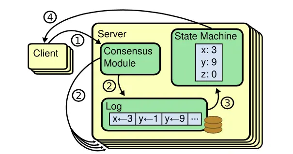
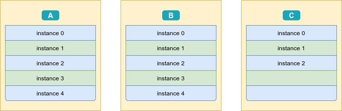
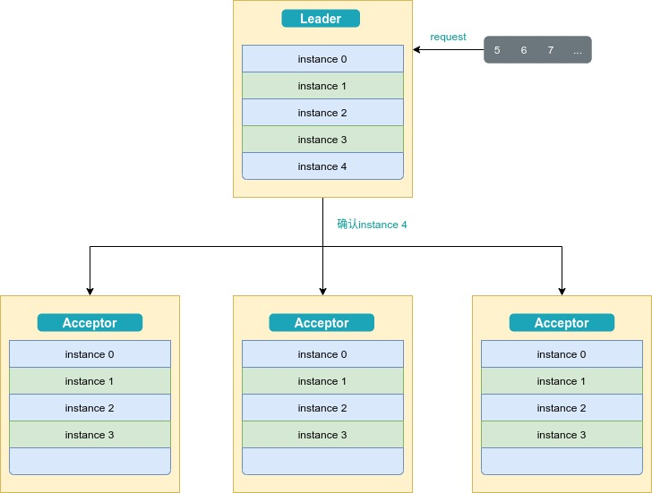
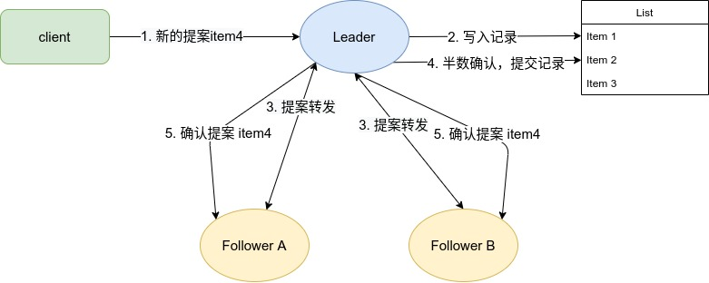

### 前言

分布式系统中，保证各个分区达成一致是保障系统正常工作的核心。而共识算法就是用来保证分布式系统一致性的方法。

### 复制状态机

复制状态机是一种保证多个副本一致的一种方法，它由共识模块、日志模块、状态机组成。通过共识模块保证各个节点日志的一致性，然后各个节点基于同样的日志、顺序执行指令，最终各个复制状态机的结果实现一致。它的核心就是共识模块，各个系统中往往会有它们各自的实现，下文中将介绍几种常见的共识算法。



### Basic-Paxos

**Paxos算法**是[莱斯利·兰伯特](https://zh.wikipedia.org/wiki/莱斯利·兰伯特)于1990年提出的一种基于消息传递且具有高度容错特性的共识（consensus）算法。

Paxos将系统中的角色分为提议者 (Proposer)，决策者 (Acceptor)，和学习者 (Learner):

#### 流程描述

- Proposer

  - 准备阶段
    1. 向所有的 Acceptor 发送消息“Prepare(b)”，这里 b 是 Paxos 的轮数,每轮递增
    2. 如果收到任何一个 Acceptor 发送的消息“Reject(B)”,则对于这个 Proposer 而言本轮 Paxos 失败,将轮数 b 设置为 B+1 后重新步骤 1

  - 批准阶段
    1. 如果接收到的 Acceptor 的“Promise(b, v_i)”消息达到 N/2+1 个(N 为 Acceptor 总数,除法取整,下同);v_i 表示 Acceptor 最近一次在 i 轮批准过 value v。
    2. 如果收到的“Promise(b, v)”消息中,v 都为空,Proposer 选择一个 value v,向所有 Acceptor 广播 Accept(b, v);
    3. 否则,在所有收到的“Promise(b, v _ i)”消息中,选择 i 最大的 value v,向所有 Acceptor 广播消息 Accept(b,v);
    4. 如果收到 Nack(B),将轮数 b 设置为 B+1 后重新步骤 1;

- Acceptor

  - 准备阶段
    1. 接受某个 Propeser 的消息 Prepare(b)。参数 B 是该 Acceptor 收到的最大 Paxos 轮数编号;V 是 Acceptor 批准的 value,可以为空
    2. 如果 b>B,回复 Promise(b, V_B),设置 B=b; 表示保证不再接受编号小于 b 的提案。否则,回复 Reject(B)
  - 批准阶段
    1. 接收 Accept(b, v)，如果 b < B, 回复 Nack(B),表示 proposer 有一个更大编号的提案被这个 Acceptor 接收了
    2. 否则设置 V=v。表示这个 Acceptor 批准的 Value 是 v。广播 Accepted 消息。

- Learner

  学习者学习被批准的value，一般有三种实现：

  1. Acceptor批准一个Propeser，将其发送给所有学习者
  2. Acceptor批准一个Propeser，将其发送给主学习者，由主学习者发送给其他学习者
  3. Acceptor批准一个Properser，将其发送给一组学习者，由这组学习者发送给其他学习者

```wiki
Client   Proposer      Acceptor     Learner
   |         |          |  |  |       |  | --- First Request ---
   X-------->|          |  |  |       |  |  Request
   |         X--------->|->|->|       |  |  Prepare(N)
   |         |<---------X--X--X       |  |  Promise(N,I,{Va,Vb,Vc})
   |         X--------->|->|->|       |  |  Accept!(N,I,V)
   |         |<---------X--X--X------>|->|  Accepted(N,I,V)
   |<---------------------------------X--X  Response
   |         |          |  |  |       |  |
```

#### 多值确定

上诉算法可以看出来，一次paxos运行只能将一个值确定，但是一个系统往往是需要确定许多个值。为了解决上诉问题，我们引入实例的概念。

**实例：**运行一个上诉paxos算法确定一个值的流程可以称为一个paxos实例，那么要确认多个值，就可以运行多个paxos实例。

**具体流程: **首先给实例一个编号，定义为i，i从0开始，只增不减，由本机器生成，不依赖网络。其次，我们保证一台机器任一时刻只能有一个实例在工作，这时候Proposer往该机器的写请求都会被当前工作的实例受理。最后，当编号为i的实例获知已经确定好一个值之后，这个实例将会被销毁，进而产生一个编号为i+1的实例。由于实例编号代表当前的paxos需要确定的值，所以多个机器可以有序的确认多个值。



上图三台机器，执行一系列paxos 实例，假设每个实例都是确定一个值，由于网络，宕机，延迟等原因机器上的数据可能会出现不一致，在这种情况下是如何正确运转呢? 假设机器C提案新的值，所以会创建instance 3， 但是在发起paxos准备阶段就会发现，instance 3 已经被多数确认，所以机器C会写入instance 3真正的值，然后增加自身编号重试。

Paxos系统中有一个角色是Learner， 定期查询集群中实例状态，学习确定后的实例值保存。

#### 总结

Basic-Paxos 是通过类似二阶段提交的方式，确保一轮中某个提案被批准，而提案一旦被批准，则后续所有的提案都无法改变。Paxos的典型部署需要一组连续的被接受的值（value），作为应用到一个分布式状态机的一组命令。如果每个命令都通过一个Basic Paxos算法实例来达到一致，会产生大量开销。因此Basic Paxos几乎只是用来做理论研究，并不直接应用在实际工程中。


### Multi-Paxos

Multi-Paxos是在Basic-Paxos 的基础上进行了简化处理，一个Basic Paxos 实例只能就单个值（Value）达成共识，如果我们直接通过多次执行 Basic Paxos 实例，来实现一系列值的共识，就会存在这样几个问题：

1. 多个提议者同时提交提案，可能出现因为提案编号冲突，在准备阶段没有提议者接收到大多数准备响应，协商失败，需要重新协商。
2. 两轮 RPC 通讯（准备阶段和接受阶段）往返消息多、耗性能、延迟大

为了解决上诉问题，引入了Leader Propeser的概念，所有的提案均由Leader提交，故领导者节点上，序列中的命令是最新的，不再需要通过准备请求来发现之前被大多数节点通过的提案，领导者可以独立指定提案中的值。这时，领导者在提交命令时，可以省掉准备阶段，直接进入到接受阶段。

Multi-Paxos通过Leader Propeser的方式，可以省略掉准备阶段的通讯，节省大量开销。但是需要系统有一个选主的机制，可以使用Basic Paxos选Leader。然后由Leader来执行后续的提案。



Multi-Paxos允许有多个自认为是Leader的节点并发提交Proposal而不影响其安全性，这样的场景即退化为Basic Paxos。

Chubby和Boxwood均使用Multi-Paxos。ZooKeeper使用的Zab也是Multi-Paxos的变形。

### Raft

由于Paxos算法过于难以理解，并且Paxos 自身的算法结构需要进行大幅的修改才能够应用到实际的系统中。于是一个新的共识算法Raft被设计出来了，Raft的目标是提供更清晰的逻辑分工使得算法本身能被更好地理解，同时它安全性更高，并能提供一些额外的特性。Raft能为在[计算机集群](https://zh.wikipedia.org/wiki/计算机集群)之间部署[有限状态机](https://zh.wikipedia.org/wiki/有限状态机)提供一种通用方法，并确保集群内的任意节点在某种状态转换上保持一致。

Raft这一名字来源于"Reliable, Replicated, Redundant, And Fault-Tolerant"（“可靠、可复制、可冗余、可容错”）的首字母缩写。集群内的节点都对选举出的领袖采取信任，因此Raft不是一种[拜占庭容错](https://zh.wikipedia.org/wiki/拜占庭将军问题)算法。

Raft是从Paxos算法优化过的一种具体实现，它通过问题分解，将复杂的共识问题拆分成三个子问题，分别是：

- **Leader 选举:** Leader 故障后集群能快速选出新 Leader；
- **日志复制:** 集群只有 Leader 能写入日志， Leader 负责复制日志到 Follower 节点，并强制 Follower 节点与自己保持相同；
- **安全性:** 一个任期内集群只能产生一个 Leader、已提交的日志条目在发生 Leader 选举时，一定会存在更高任期的新 Leader 日志中、各个节点的状态机应用的任意位置的日志条目内容应一样等。

#### Leader 选举

Raft 协议中它定义了集群中的节点的三种状态：

- Follower，跟随者， 同步从 Leader 收到的日志，etcd 启动的时候默认为此状态；
- Candidate，竞选者，可以发起 Leader 选举；
- Leader，集群领导者， 唯一性，拥有同步日志的特权，需定时广播心跳给 Follower 节点，以维持领导者身份。

当 Follower 节点接收 Leader 节点心跳消息超时后，它会转变成 Candidate 节点，并可发起竞选 Leader 投票，若获得集群多数节点的支持后，它就可转变成 Leader 节点。

##### term

Raft引入term(任期)的概念， term（任期）以选举（election）开始，然后就是一段或长或短的稳定工作期（normal Operation）。任期是递增的，通过任期号，可以比较各个节点的数据新旧、识别过期的 Leader 等，它在 Raft 算法中充当逻辑时钟，发挥着重要作用。

##### 选举流程

1. 在起始算法或领袖死机、断线的时候，就需要选举出新的领袖。

2. 此时集群进入新的任期（英语：term）并开始选举，如果选举成功则新的领袖开始运行工作，反之则视此任期终止，开始新的任期并开始下一场选举。

3. 选举是由候选人发动的。当领袖的心跳超时的时候，追随者就会把自己的任期编号（英语：term counter）加一、宣告竞选、投自己一票、并向其他服务器拉票。每个服务器在每个任期只会投一票，固定投给最早拉票的服务器。

4. 如果候选人收到其他候选人的拉票、而且拉票的任期编号不小于自己的任期编号，就会自认落选，成为追随者，并认定来拉票的候选人为领袖。如果有候选人收到过半的选票就当选为新的领袖。如果超时仍没有选出新领袖，此任期自动终止，开始新的任期并开始下一场选举。

5. Raft每个服务器的超时期限是随机的，这降低伺服务同时竞选的几率，也降低因两个竞选人得票都不过半而选举失败的几率。

#### 日志复制

由Leader负责日志复制。

整个集群有个复制的状态机，可执行外来的指令。Leader接收指令，将之写入自己记录中的新指令部分，然后把指令转发给追随者。如果有追随者没反应，Leader会不断重发指令、直到每个追随者都成功将新指令写入记录为止。

当Leader收到过半追随者确认写入的消息，就会把指令视为已存储（committed）。当追随者发现指令状态变成已存储，就会在其状态机上运行该指令。

当Leader死机时，Leader的某些新指令可能还没复写到集群整体，造成集群的记录处于不一致的状态。新Leader会担起重返一致的责任，让每个追随者的记录都和它的一致，做法是：和每个追随者比对记录，找出两者一致的最后一笔指令，删除追随者之后的指令，把自己之后的指令拷贝给追随者。这个机制完成时，每个服务器的记录就会一致。




每个日志除了包含command,还包含产生该日志的Leader的任期(term),用于保障系统的一致性。leader只需要日志被复制到大多数节点即可向客户端返回，一旦向客户端返回成功消息，那么系统就必须保证log（其实是log所包含的command）在任何异常的情况下都不会发生回滚。这里有两个词: commit(committed), apply(applied)。前者是指日志被复制到了大多数节点后日志的状态；而后者则是节点将日志应用到状态机，真正影响到节点状态。


#### 安全性

在任何系统模型下，都需要满足safety属性，即在任何情况下，系统都不能出现不可逆的错误，也不能向客户端返回错误的内容。为了保证系统的安全性，Raft协议保证了五个安全性：Election Safety， Leader Append-Only， Log Matching， Leader Completeness， Stae Machine Safety。

- Election Safety 选举安全性

  每个任期内最多只有一个Leader被选出，在一个复制集中任何时刻只能有一个leader。系统中同时有多余一个leader，被称之为脑裂（brain split），这是非常严重的问题，会导致数据的覆盖丢失。在raft中，两点保证了这个属性：

  - 一个节点某一任期内最多只能投一票
  - 只有获得多数投票的节点才会成为leader

- Leader Append-Only 领袖附加性：领袖只会把新指令附加（英语：append）在记录尾端，不会改写或删除已有指令。

- Log Matching 记录符合性

  如果两个节点上的某个log entry的log index相同且term相同，那么在该index之前的所有log entry应该都是相同的. 通过一下两条来保证：

  - If two entries in different logs have the same index and term, then they store the same command.
  - If two entries in different logs have the same index and term, then the logs are identical in all preceding entries.

  由于在同一时间只有一个Leader，Leader保证不会在同一个term创建两个相同的index的log，也就是Election Safety和Append-Only保证了第一条。

  第二条在没有异常的情况下，是很容易满足的，但如果出现了node crash，情况就会变得复杂，当出现了leader与follower不一致的情况，leader强制follower复制自己的log。leader会维护一个nextIndex[]数组，记录了leader可以发送每一个follower的log index，初始化为leader最后一个log index加1，leader选举成功之后会立即给所有follower发送AppendEntries RPC（不包含任何log entry， 也充当心跳消息）,具体流程：

  >  1. leader 初始化nextIndex[x]为 leader最后一个log index + 1
  >  2. AppendEntries里prevLogTerm prevLogIndex来自 logs[nextIndex[x] - 1]
  >  3. 如果follower判断prevLogIndex位置的log term不等于prevLogTerm，那么返回 False，否则返回True
  >  4. leader收到follower的回复，如果返回值是False，则nextIndex[x] -= 1, 跳转到s2. 否则
  >  5. 同步nextIndex[x]后的所有log entries

- Leader Completeness 领袖完整性：如果某个指令在某个任期中存储成功，则保证存在于该任期之后的所有记录中。

- Stae Machine Safety 状态机安全性：如果某服务器在其状态机上运行了某个指令，其他服务器保证不会在同个状态上运行不同的指令。

#### 总结
Raft 是共识算法里面在工程界应用最广泛的算法，它将一个复杂的问题拆解成三个子问题：Leader 选举、日志复制和安全性。通过保障以上三点可以更加明确的实现工程落地。consul，etcd等均使用的是Raft算法。